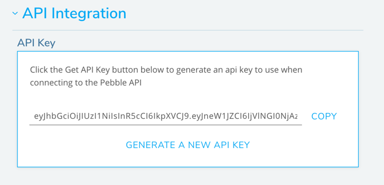

## Generating an API Key
Each API key is specific to a gym. Even if you have access to multiple gyms, you must use a different api key to authorize the connection to each gym.

#### 1. Login to Pebble as a manager.
Make sure you are logged in to [pebbleclimbing.com](https://www.pebbleclimbing.com) as a manager. To gain access please contact the person that signed you up for Pebble at your gym or any other user with managerial permissions for your gym on Pebble.

#### 2. Navigate to the Edit Gym page.
Navigate to your gym's page from the [gyms](https://www.pebbleclimbing.com/gyms) section of Pebble. Click on the "Pencil" icon beside the gym's name.

#### 3. Create an API key
Open the "API Integration" section and click on "Generate an API Key" to generate a new api key. Copy this key to use as an authorization when connecting to the API.

Next Up: [Connecting to the API](/api/connecting-api)

