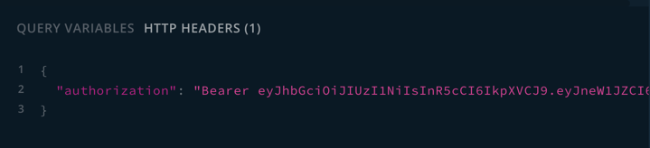
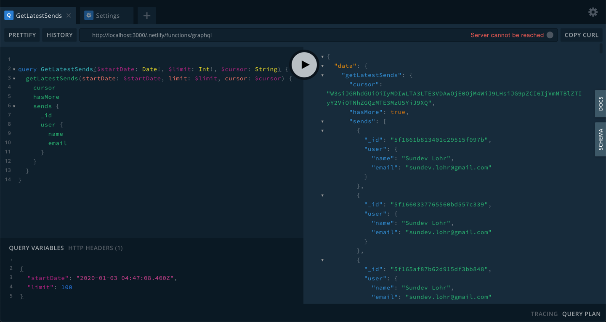

## API queries

### GraphQL Playground
You can use the graphql playground to inspect the schema and test the query parameters by going here:
https://www.pebbleclimbing.com/.netlify/functions/graphql

#### Exploring the docs


#### Authorizing with your token



#### Querying


#### Available Queries
The API supports the following queries:

* [getLatestSends](/api/queries/#getlatestsends)
* [getLatestAttempts](/api/queries/#getlatestattempts)
* [getLatestProblems](/api/queries/#getlatestproblems)
* [getLatestRoutes](/api/queries/#getlatestroutes)
* [getLatestProblemGrades](/api/queries/#getlatestproblemgrades)
* [getLatestRouteGrades](/api/queries/#getlatestroutegrades)
* [getLatestProblemQualities](/api/queries/#getlatestproblemqualities)
* [getLatestRouteQualities](/api/queries/#getlatestroutequalities)


### Cursor Based Pagination
All queries use cursor based pagination. So you can call the query with a date and limit and the response will return a cursor that is used to get the next batch of items if there are any. All responses have the following format, with `[items]` being the name of the items you want: 

``` 
{
  hasMore: Boolean,
  cursor: String,
  [items]: Collection
}
```

<br/>

### API Queries

#### getLatestAttempts
```
getLatestAttempts(startDate: Date!, limit: Int!, cursor: String):AttemptList
```
Returns a list of the latest attempts at your gym after a specific date. 

#### getLatestSends
```
getLatestSends(startDate: Date!, limit: Int!, cursor: String):SendList
```
Returns a list of the latest sends at your gym after a specific date.
#### getLatestProblems
```
getLatestProblems(startDate: Date!, limit: Int!, cursor: String, query: String):ProblemList
```
Returns a list of boulder problems at your gym that were set after the start date.

#### getLatestRoutes
```
getLatestRoutes(startDate: Date!, limit: Int!, cursor: String, query: String):RouteList
```
Returns a list of routes at your gym that were set after the start date.

#### getLatestProblemGrades
```
getLatestProblemGrades(startDate: Date!, limit: Int!, cursor: String): GradeList
```
Returns a list of grades that user's have given problems after the start date

#### getLatestRouteGrades
```
getLatestRouteGrades(startDate: Date!, limit: Int!, cursor: String): GradeList
```
Returns a list of grades that user's have given routes after the start date

#### getLatestProblemQualities
```
getLatestProblemQualities(startDate: Date!, limit: Int!, cursor: String): QualityList
```
Returns a list of star ratings that user's have given problems after the start date
#### getLatestRouteQualities
```
getLatestRouteQualities(startDate: Date!, limit: Int!, cursor: String): QualityList
```
Returns a list of star ratings that user's have given routes after the start date
