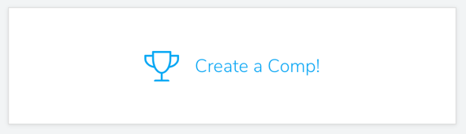

## Competitions

#### 1. Login to Pebble as a manager. 
Make sure you are logged in to [pebbleclimbing.com](https://pebbleclimbing.com) as a manager. To gain access please contact the person that signed up for Pebble at your gym or any other user with managerial permissions on Pebble.

#### 2. Navigate to your gym's page and click on the "Create a Comp" card.
  

#### 3. On the next page, fill out the form to create a new competition.
  - Name your competition.
  - Add a description to your competition.
  - Add registration dates.
    - The registration open date will mark the date when the competition will be visible to all users of Pebble and they will be able to register for the competition.
    - The registration closing date will mark when registration will close and users can no longer register and teams can no longer change members.
  - Add a registration link.
    - This is an external link to a page where users can pay for the competition. Once the competition is created, you will get a link you can use to direct users to register after they have paid.
  - Choose the dates of the start and end of the competition. After the end of the competition, the competition will be hidden on Pebble.
  - Finally, choose the competitor type, Team or Individual. If you choose "Team", you will need to enter in the maximum and minimum number of competitors on a team.

