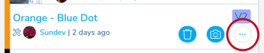
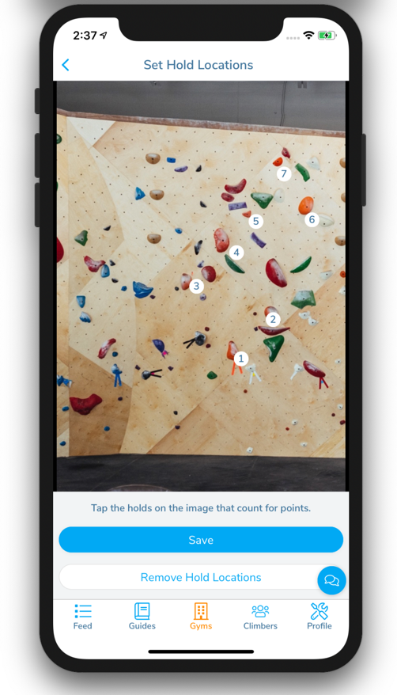

## Adding Climbs to a Competition Round

Adding climbs to a competition round can be done either on the website or using the app. See [Creating a Comp Round](/competitions/create-comp-set) for how to add climbs using the site. This page will go over how to add climbs using the app. See

### 1. Create the set as you normally would when route setting

In the areas added to the comp round, add climbs to the area as you would when normally routesetting. See [Route Setting](/route-setting) for how to do that.

### 2. Add to the Comp

After creating the climbs, click on the menu button "..." below the grade on the climb row to bring up the route setting menu.

Choose "Add to Comp" from the menu to bring up the form to add it to the comp.

### 3. Define comp settings for the climb

The comp round and climb will be listed above the form. You can fill out a custom name to correspond to the comp in some way. For instance, "Women’s Semifinal" or "#20 Bouldering League". You should also add points the climb is worth and if you are grading by hold gotten to, add the number of scoring holds on the climb.

### 4. Add a Scoring Image

If you are scoring by holds on the climb, it's a good idea to add a scoring image. This image will denote which holds are worth points and in what order the points are assigned. Click on the "Add Scoring Image" button to add an image for scoring holds.

Either take a picture of the route or choose one from your gallery on your phone and set this as the picture to use.

### 5. Mark the Scoring Holds

Tap on the holds in the image that correspond to the holds that are scored. Tap in the order you want to score the holds. If you mess up, you can start over by pressing the "Remove Hold Locations" button. Once you have tapped all the scoring holds, press "Save". Don't forget to add the final hold or top of the wall as a scoring hold.

### 6. Save

Save the climb's comp settings and this climb will be added to the comp round. Feel free to edit it in the same way if something is wrong.
