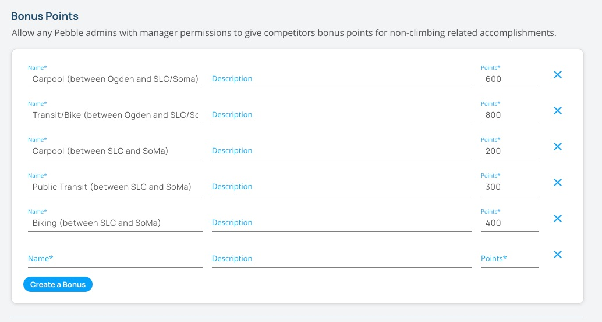
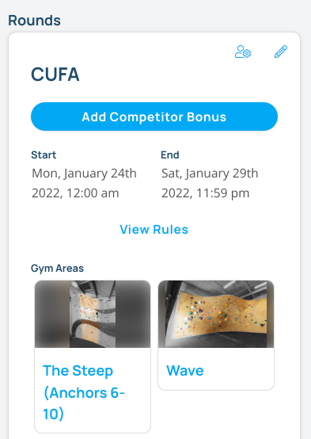
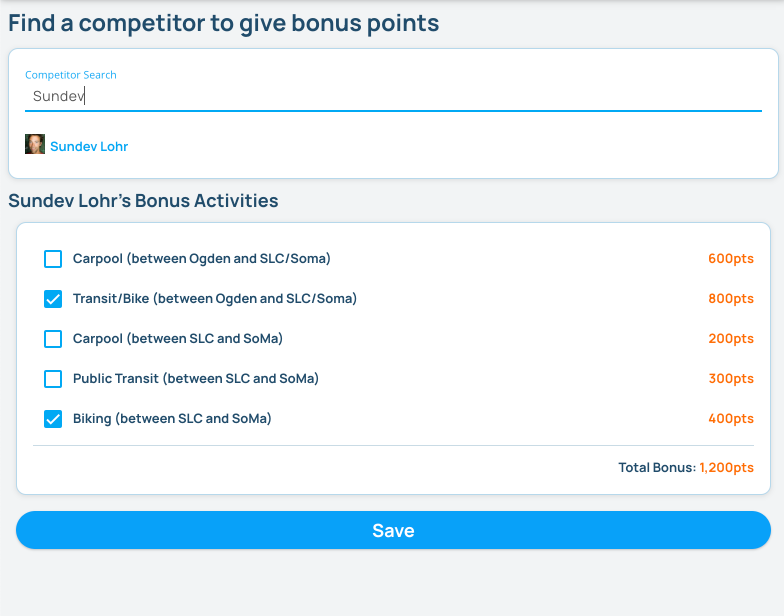

## Comp Bonus Activities

You can create bonus activities for competitions. Completion of these activities will award points to the competitor. Any employees logged in as a manager on the Pebble website can give bonus points to any competitors.

### Creating Bonus Activities

Bonus activities are competition round specific. To create bonus activities for a competition round, edit the competition round and find the "Bonus Activities" section. Click the "Create a bonus" button to add a new bonus activity. Fill out the name, description and points for the bonus activity. Once you have added all your bonus activities, scroll down to the bottom of the page and click the "Save" button.

### Giving Bonus Points

On the webpage for the Competition, scroll down to the Comp rounds toward the bottom of the page. If a round has bonus activities and you are logged in with manager privileges, you will see a button named "Add Competitor Bonus". Click the button to give bonus points to a competitor.

On the next page, search for the competitior you want to give bonus points to. Click on the competitor and click the checkboxes next to each bonus activity. Once you have selected all the bonus activities, click the "Save" button.

