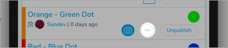
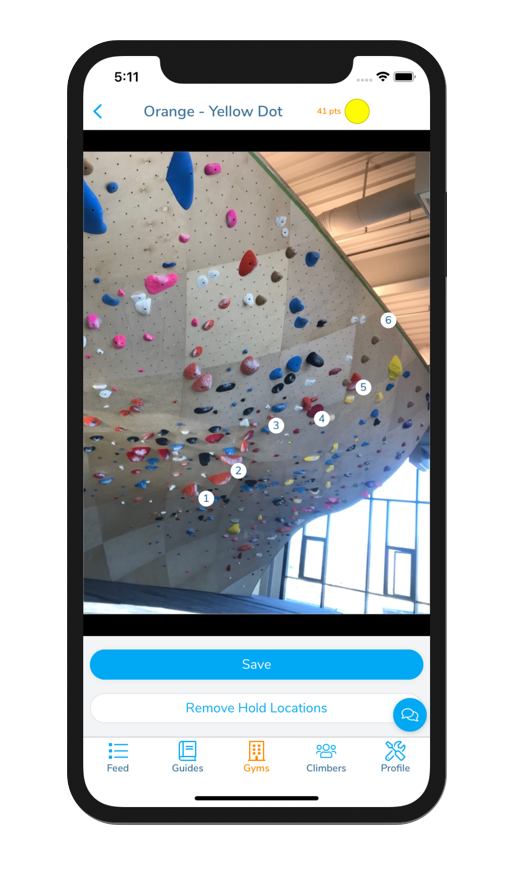

## Creating a Scoring Image for a Comp Climb
For a Comp Round that scores its climbs by holds, it is helpful to create comp scoring images associated with each climb. Comp scoring images are images of climbs in the comp that have each scored hold marked with a number. These can be created in the Pebble Mobile App.

### 1. Switch to route setting mode in the app and navigate to the area in the gym where the climbs are located.
If you're unsure how to switch to route setting mode, please refer to the [Route setting](./route-setting) section of the documentation.

### 2. In the row corresponding to the climb, click on the "&hellip;" button to bring up the route setting menu.

### 3. Select "Add Scoring Image" to add an image.
Choose an image from your library or take a picture of the climb.

### 4. Mark the holds that count toward points.
Tap on the holds that count for points on the climb. Make sure to tap in the order that the points are assigned. Hit "Save" when you are done or "Remove Hold Locations" if you mess up.

