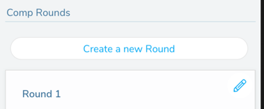

## Creating a Comp Set in the App

You can create a Comp Set or competiton round in both the website and the app. To create a comp round on the website, look here: [Creating a Comp Set](/competitions/create-comp-set)

Make sure you are in setting mode in the app and navigate to the comp screen that you want to add a new round to and tap "Create a New Round"

On the form that appears, enter in the name and settings for the new round.

Add areas to the new round. Once these areas are added to the round, any climbs in these areas can be added to the comp by any of the route setters.

Save your settings and then navigate to the areas to add their climbs to the comp.

Next Up [Adding Climbs to a Comp Set on the App](/competitions/add-climbs-comp-set)
