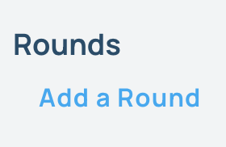

## Creating a Set of Climbs for a Competition
Comp Sets are the climbs in the gym that have been set for the competition. Comp sets could be the problems set for a weekly round in a bouldering league, all the climbs in the gym for a citizens comp, or a single finals route round for the pro division of a more formal comp. It's a way of organizing a set of climbs that have similar scoring and timeline constraints.
Make sure you have already added the climbs that are part of the competition as you would any other climb in Pebble. If you haven't done that and are wondering how, please refer to the [Route Setting](/route-setting) section of this documentation.

### 1. Login to Pebble as a head routesetter.
Make sure you are logged in to [pebbleclimbing.com](https://pebbleclimbing.com) as a head routesetter. To gain access please contact the person that signed you up for Pebble at your gym or any other user with managerial permissions on Pebble.

### 2. Navigate to the page representing the competition you are setting routes for and click the "Add a Set" button.

### 3. On the next page, fill out the form to create a new comp set. 
- **Name** your new comp set.
- Define the start and end **dates** for when competitors are allowed to log a score for the climbs.
- Click on the switch if the **scoring** will be based on the highest hold reached.
- Click on the next switch if **attempts** will count against your score.
- Type in the **number of climbs** that count toward your score for this set of climbs. 
- Choose the **Gym Areas** where the climbs for this round are set.
- Click **Create a New Comp Round**

### 4. Add climbs to the comp set.
Once you have saved your comp set, you will see all the climbs in the seleced areas appear below. Click on the switch next to each climb to activate that climb as part of this comp set. Add a max score for each activated climb and add the number of holds that will be scored if you are scoring by holds.

Next Up [Creating Comp Score Images](./create-comp-score-images)
