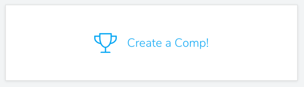
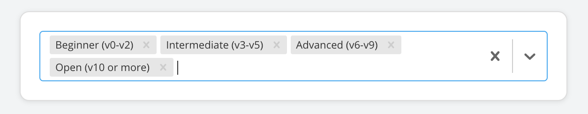
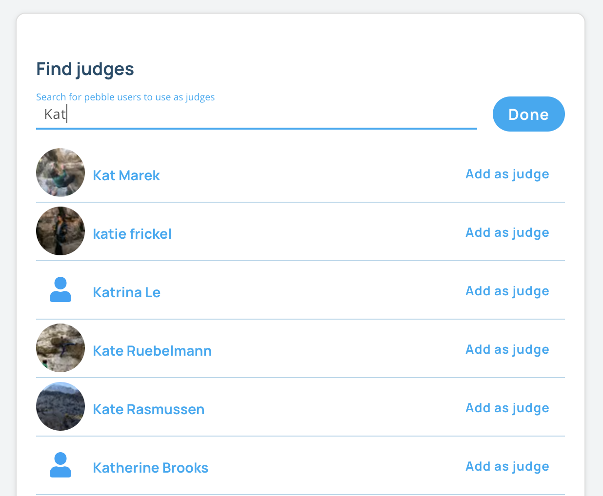
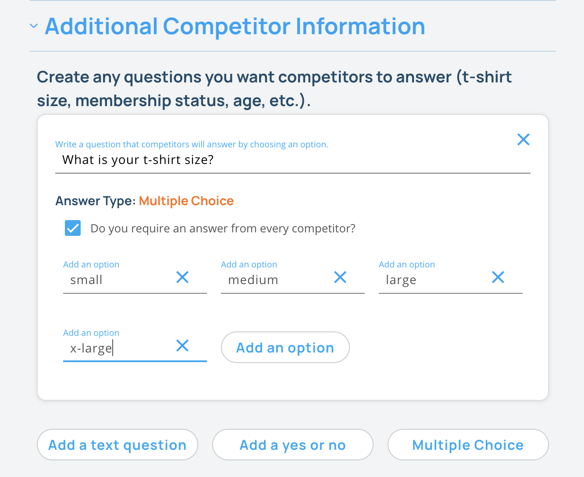

## Create a Competition

### 1. Login to Pebble as a manager.

Make sure you are logged in to [pebbleclimbing.com](https://pebbleclimbing.com) as a manager. To gain access please contact the person that signed you up for Pebble at your gym or any other user with managerial permissions on Pebble.

### 2. Navigate to your gym's page and click on the "Create a Comp" card.

If you don't see this card, make sure you have "manager" permissions for this gym.

### 3. On the next page, fill out the form to create a new competition.

#### Comp Details

- **Name** your competition.
- **Hide** this competition. This is helpful for creating test comps to test out your competition structure before running a public competition. You can invite people to register for the comp using the registration link, but other users of Pebble won't be able to see the competition.
- **Invite Only** can be selected if you don't want anyone to be able to register and want to be able to invite specific people to compete.
- Select the **gyms** that will be used for this comp if you are a manager of more than one gym.
- Add a **description** for the comp.
- Add any rules for the comp. Pebble will list a simple version of the rules for each round, but you can add more detailed rules here.
- Drop an **image** into the add image field to use as the comp's image.
- Add **registration dates**.
  - The registration open date will mark the date when the competition will be visible to all users of Pebble and they will be able to register for the competition.
  - The registration closing date will mark when registration will close and users can no longer register and teams can no longer change members.
- Choose the **dates of the competition**s. A week after the end of the competition, the competition will be archived on Pebble.
- Choose a method of **payment** for the competition. You can link your gym's Stripe account to Pebble to allow users to pay with Stripe. You can also use a registration link if you want to use a different payment method, but there is no way for Pebble to know if they actually paid, so we discourage this option.
- If you plan to broadcast the comp online, you can add a **livestream link** here and visitors to the comp page on Pebble can watch the compeitition. You can also add a link to a highlights reel or recording of the comp here.

#### Competition Structure & Rules

- **Limit Competitors** if you want to limit the number of competitors allowed to register for the comp.
- You can also ask competitors to sign up for a specific **Session** or time-slot when they will climb. These aren't enforced by Pebble. Users can still log sends if a comp round is going on, but this will encourage them to climb at the time they've selected.
- Choose whether you want this comp to be a **team comp** or an **individual comp**.
- Add any **categories** that competitors can choose from based on how hard they climb. You can also create competition rounds that will only include a certain category.

- **How to videos** - if you plan on using either peer scoring, where other competitors act as judges or proper judges to score rounds like a finals round, you can switch these on and in the app, users will see videos on how to create and judge scores.

- Turn on any of the options below. These options are usually only used for **Bouldering League** style comps.
  - Choose whether to **Drop the lowest scoring round** which can be used with multiple similar rounds like a bouldering league.
  - Choose whether to **Break ties using additional sends**. This option is helpful when creating bouldering league type scoring that uses relative scoring since ties can be common.
  - Choose whether to **Show an overall score** which will add all the rounds together and show a leaderboard of the resulting scores.
  - Choose whether to **Enable relative scoring** which makes the score a climber gets relative to their ability. This will set it up so that all the climbs have the same score and users are scored based on the hardest climb they can compete in 5 tries.
  - If relative scoring is turned on, you'll need to select the **type of climbing** in the comp so that users will be asked what their hardest grade is for the type(s) of climbing in the comp.
- If you are using relative scoring, **climbers can get bumped** if they end up climbing better than they set their maximum grade to. If this happens, pebble can bump them to a harder grade and score any climbs from the moment they get bumped with the new maximum grade. Set the number of climbs above the competitors set grade when a bump occurs. If you set this to 0, no bumping will ever occur.

- Add any users of Pebble as **judges** if any of the rounds during the comp will require judges for any of the rounds.
  

#### Additional Competitor Information

- Add any additional questions you want to ask the competitors. You can download a spreadsheet of each competitor's answers at any time during the competition.
  

#### Click **Save** to view the created competition page.

Next Up: [Creating a Comp Round](/competitions/create-comp-set)
