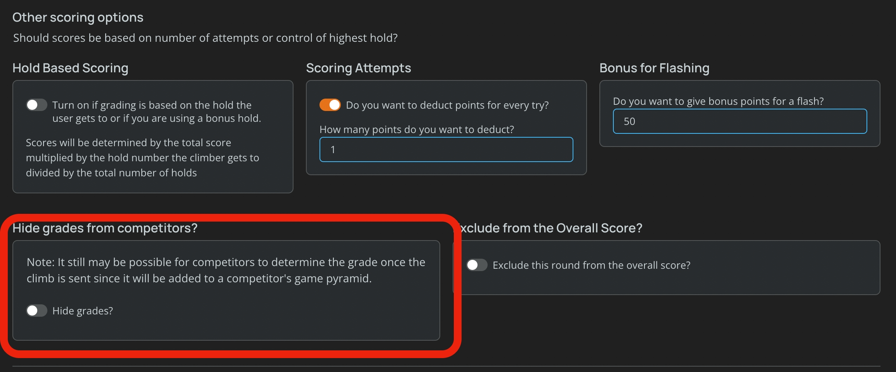

import PhoneImageWrapper from "../../src/components/PhoneImageWrapper"
import ShowAreaGrades from "../images/show-area-grades.jpg"
import HideClimbGrade from "../images/hide-climb-grade.jpg"

## Hiding Grades 

You can choose to hide the grades for specific climbs. Pebble allows you to hide grades for an entire compeitition round or for a specific climb. 

### Hiding Grades for a Competition Round
To hide grades for a specific competition round, follow these steps:

1. Navigate to the competition round edit page on the website.
2. Open up the "Comp Round Details" if it's not already open when you go to the page. 
3. The hide grades toggle is under the "Othe Scoring Options".
4. Save your changes.

This will ensure that grades are not visible to competitors during the round.

**Note: Once a competitor logs a grade, it will show up in their game pyramid and in that way, they can figure out the grade of the climb.**

### Hiding Grades for a specific climb

To hide grades for a specific climb, follow these steps:

1. Make sure you're in setter mode, and navigate to the gym area screen in the app.
2. Tap the 3 dots icon to open the setter menu.
3. Click on the "Hide Grade from Members" option.

This will ensure that grades are not visible to members for that specific climb.
<PhoneImageWrapper alt="Hide Grade from Members" src={HideClimbGrade} />

### Showing all Grades in an Area
To show all grades in an area, follow these steps:
1. Make sure you're in setter mode, and navigate to the gym area screen in the app.
2. Tap the "Show Hidden Grades" button at the top of the screen.

<PhoneImageWrapper alt="Show Area Grades" src={ShowAreaGrades} />