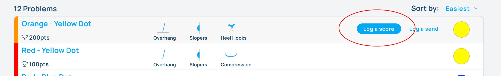
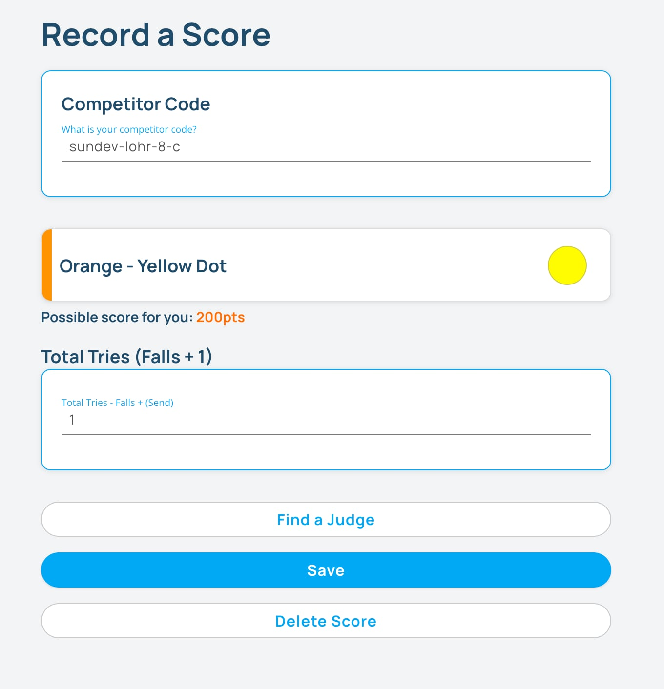
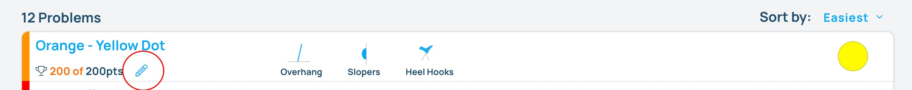

## Competitor Code Based Scoring

For users that don't have a phone, you can setup computers or tablets and allow them to log their scores without having to login to Pebble.

### Getting competitors’s competitor code

Navigate to the [Manage Competitors](/competitions/manage-competitors) page of the website and either look up the competitor's "Competitor Code" in the table or download the Spreadsheet and find it there.

You can then give out this code to each competitor that wants to use the code to log their scores.

### Logging a score with the competitor code

On the computers or tablets that competitors will use to log their scores, navigate to the comp page on the Pebble website and **make sure no one is logged in to the website**.

Have the competitor navigate to the gym area on the website. Hover over on the row of the climb they want to score and click "Log a Score".

Add your competitor code to the top of the form on the next page and fill out the rest of the form based on the scoring structure for the round.

The competitor's score is now logged!

If the competitor needs to edit or delete their score, they will need to login to the site, navigate to the gym areas page, and edit the score they want to edit or delete by clicking on the pencil icon on the row of the climb.

