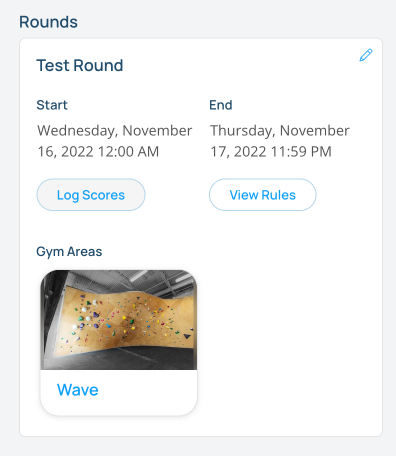

## Competitor Code Based Scoring

For users that don't have a phone, you can setup computers or tablets and allow them to log their scores without having to login to Pebble.

### Getting competitors’s competitor code

Competitors will get an email with their code when they sign up for the comp. If they don't have their email with them, you can find their code by navigating to the [Manage Competitors](/competitions/manage-competitors) page of the website and either look up the competitor's "Competitor Code" in the table or download the Spreadsheet and find it there.

### Logging a score with the competitor code

On the computers or tablets that competitors will use to log their scores, navigate to the comp page on the Pebble website and **make sure no one is logged in to the website**.

Have the competitior click on the "Log Scores" button on the comp round card. They will be prompted to enter their competitor code. Once they enter their code, they can log scores.

The competitor can then enter in their competitor code and hit "Submit"

If the competitor code matches their competitor, they can then add to, edit or delete their scores. 

Once a competitor is done adding scores, they can close the modal and the form will reset for another competitor.

