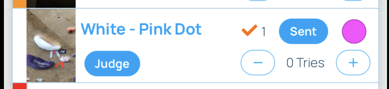

import BoulderingJudge from "../images/bouldering-judge.png"
import LeadJudge from "../images/lead-judge.png"
import PhoneImageWrapper from "../../src/components/PhoneImageWrapper"

### Logging a competitor's score as a judge

#### 1. In the app, navigate to the area in the gym where the problem that you are judging is located.

#### 2. Tap on the "Judge" button on the row of the climb you are judging.

#### 3.1. For Bouldering, fill out the form based on their attempts to zone, whether they got to the zone, attempts to top, and whether they got to the top.

<PhoneImageWrapper alt="Bouldering judge" src={BoulderingJudge} />

#### 3.2. For Lead Climbing, fill out the form based on the highest hold the competitor got to and whether they earned a plus (+). Also indicate their time in case of a tie.

<PhoneImageWrapper alt="Lead judge" src={LeadJudge} />
