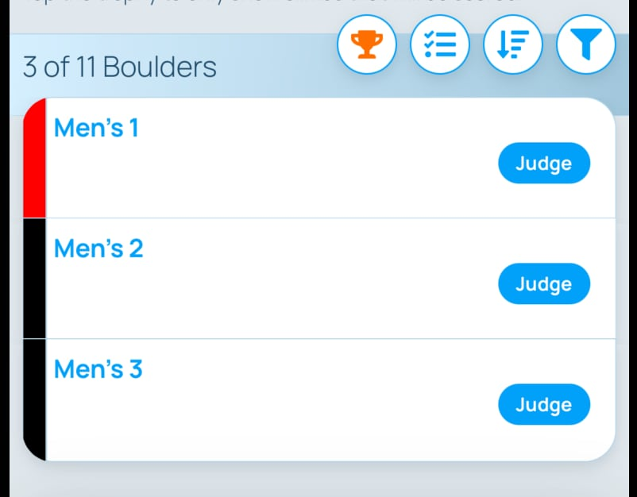

import BoulderScore from "../images/comp-scoring-instructions/boulder-score.jpg"
import RouteJudging from "../images/comp-scoring-instructions/route-judging.jpg"
import JudgingDashboard from "../images/comp-scoring-instructions/judging-dashboard.jpg"

import PhoneImageWrapper from "../../src/components/PhoneImageWrapper"
import VideoPlaylist from "../../src/components/VideoPlaylist"

### Logging a competitor's score as a judge

<VideoPlaylist videoId="r-FHpIpmEME" />

In order to log a score as a judge, make sure you are added to the list of judges in the competition. To do this, edit the competition page on the website as outlined in the [Edit Competition](/competitions/create-comp) section.

Once the round begins, you should see the comp and it's areas listed in the dashboard section of the app.

<PhoneImageWrapper alt="Judging Dashboard" src={JudgingDashboard} />

Tap on the area where the climb that you will be judging is located and then tap on the judge button on the climb's row that you are judging.

### Bouldering

For Bouldering, find the competitor and fill out the form based on their attempts to zone, whether they got to the zone, attempts to top, and whether they got to the top. As you fill out the form, the score will be saved so the leaderboard will update in real time.

<PhoneImageWrapper alt="Bouldering judge" src={BoulderScore} />

##### Modified Redpoint

Pebble supports scoring for modified redpoint rounds. Simply judge the competitor as described above. When they come back to the climb, find them in the scoring screen and Pebble will automatically update to their last score.

### Lead Climbing

For Lead Climbing, fill out the form based on the highest hold the competitor got to and whether they earned a plus (+). Also indicate their time in case of a tie. As you fill out the form, the score will be saved so the leaderboard will update in real time.

<PhoneImageWrapper alt="Lead judge" src={RouteJudging} />
