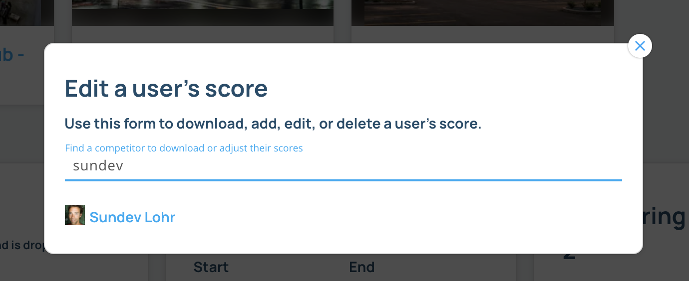

### Manage a competitor's score

If you need to add, edit, delete, or download a competitor's scores, you can use the Competitor Score Manager. This manager is specific to a round.

#### 1. Navigate to the comp page and find the round where you want to edit the scores. Then click on the manage scores icon.

#### 2. Search for the competitor who's scores you want to edit or download.

#### 3. Use the table and buttons to add, edit or delete a competitor's scores, or click the button in the top right to download a competitor's scores.

