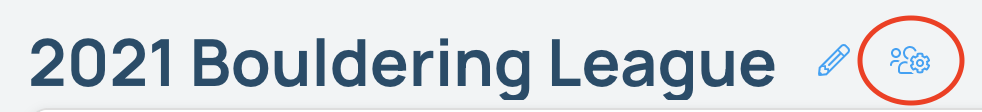
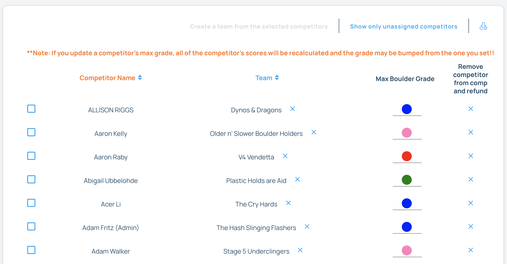
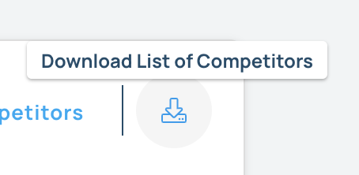
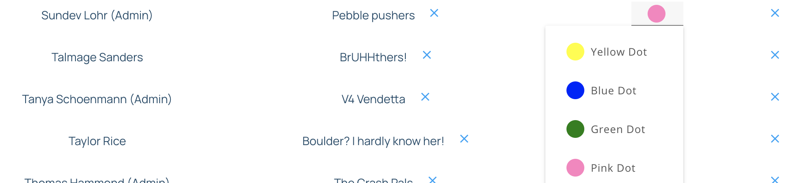

## Manage Competitors

Through the manage competitors page, you can download a list of all competitors, including the questions you asked them during registration, add competitors to teams if it's a team comp, change a competitor's max grade if the comp is scored based on the competitor's ability, and remove competitors from the competition.

#### 1. Login to Pebble as a manager and navigate to the comp page.

#### 2. Click the "Manage Competitors" icon.

the following screen will show up:

#### 3. Click the "Download List of Competitors" icon to download the competitors and their questions.

#### 4. If you are allowing floaters, select the checkbox next to any competitor that you want to assign to a team and click **Create a team from the selected competitors** or if you want to assign them to an existing team, click **Add to an existing team**

#### 5. If you need to adjust a competitor's max grade, change the max grade in the competitor's row. Note, that even if you change a score, if the competitor will get bumped according to the rules, then the max grade will be adjusted accordingly.

#### 6. You can also remove a competitor from the comp. If your comp is paying using the Stripe integration, the competitor will get a refund for the cost of the comp.

