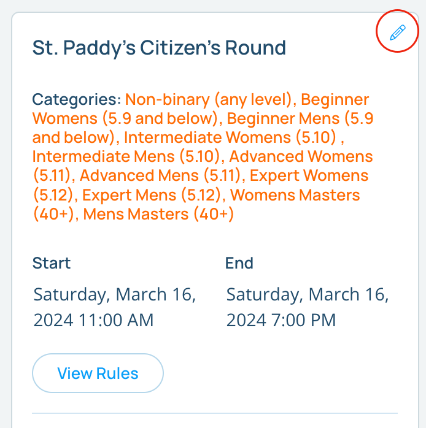
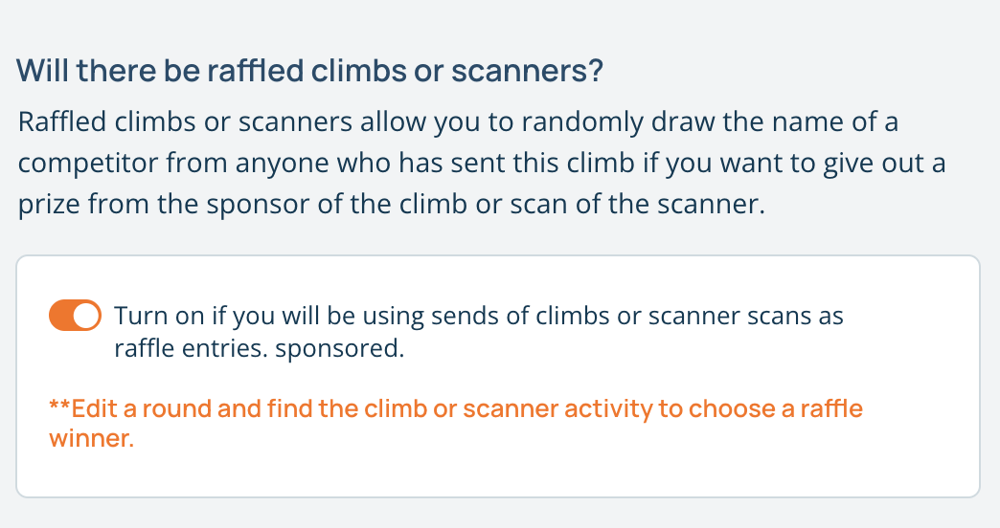
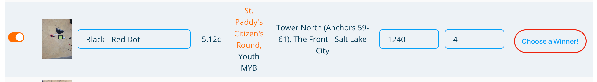
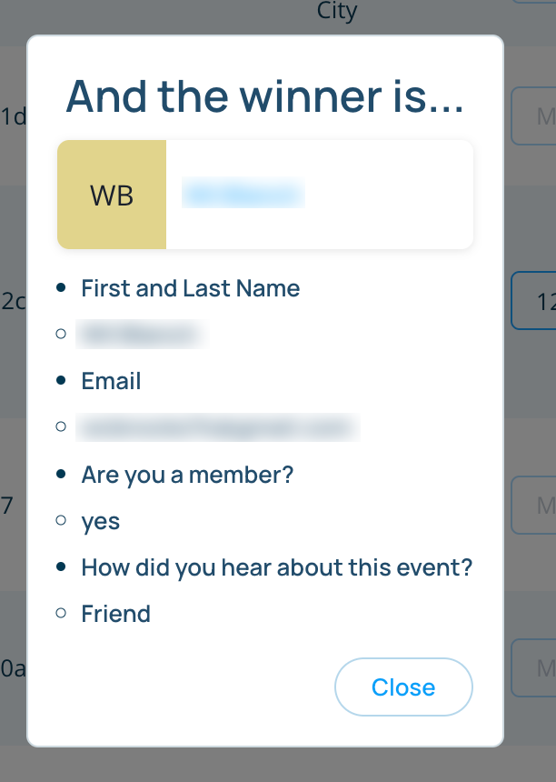

## Raffles

Many gyms setup "sponsored" climbs during competitions and give away prizes based on a raffle, drawing from the climbers who have completed the climb. Pebble allows you to quickly draw names for these types of raffles.

If your gym has Pebble Connect scanners, you can also draw from a list of names that have scanned a specific scanner that is attached to a custom activity. 

### Setting up a Raffle

A raffle is tied directly to a comp round, not the entire comp. To enable certain climbs or scanner activities to be part of a raffle, edit the comp round by clicking on the pencil icon in the top right of the comp round card on the comp's page.

 

In the edit comp round page, find the switch that corresponds to "Will there be raffled/sponsored climbs or scanners?" and turn it on.

Once you have enabled the raffle, any climbs or scanner activities in the rounds will be eligible to be part of the raffle. Just find the climb or the scanner in the "Climbs in the Round" or "Scanners" sections respectively, and click on the "Choose a winner!" text. 

 

If any competitors in the comp have completed the climb or scanned the scanner, they will be show up in the modal card that appears along with any custom questions asked during registration.

