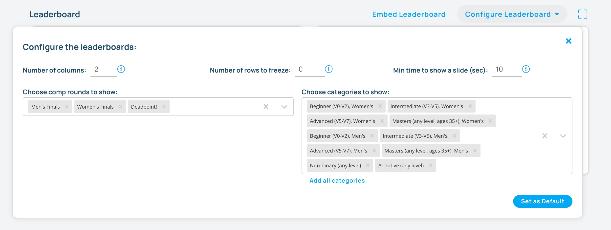

## Real-time Leaderboard

One of the main benefits of using Pebble to run your comp is the real-time leaderboard. As competitors log their scores, the leaderboard is updated in real-time.

You can project or show the leaderboard on a large screen so that the competitors can see the overall scores and how they match up.

- Click on the fullscreen button to see the leaderboard fullscreen.
- Click the play button to begin animating the leaderboard.

### Configuring the Leaderboard

When showing the leaderboard during a competition, you can configure the leaderboard in a number of ways to ensure that all scores are shown. Below are some of the options.

#### Options

- **number of columns**: The number of columns to show at one time
- **number of rows to freeze**: The number of rows to freeze at the top of the leaderboard. Use to show who will win or qualify for the next round. If there are more rows than can fit on the screen, the rows below the frozen rows will scroll up.
- **min time to show a slide**: The minimum amount of time to show a slide before scrolling to the next leaderboards. If their are enough competitors to cause scrolling, then the leaderboard will scroll until all competitors have been seen before moving to the next slide which may take longer than what is set here.
- **comp rounds to show**: Choose all the rounds that you want to show in the leaderboard.
- **categories**: Choose the categories that you want to show in the leaderboard. If left blank, all categories will be shown together. Otherwise, each category will be divided into its own leaderboard column. If a round's competitors are invited, then the categories are ignored.
- **Set as Default**: If click, these settings will be saved as the default settings for the leaderboard.

### Embedding the Leaderboard

You can embed the leaderboard in your own website or app. Click on the Embed Leaderboard button to see the code to embed the leaderboard.
