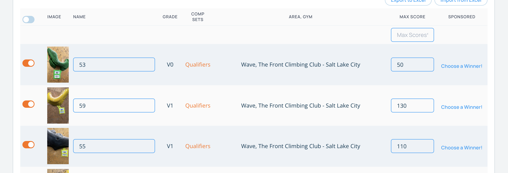
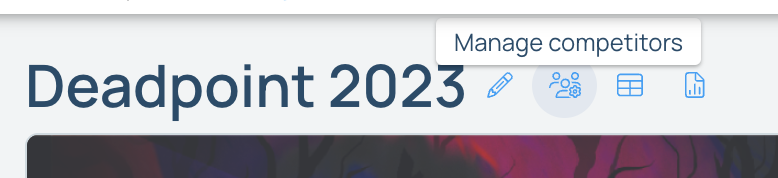
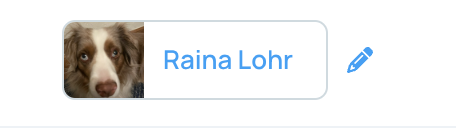

## Troubleshooting

### General errors and problems with the app

If your members are experiencing problems with the app when registering for the comp or submitting their scores, please make sure they are on the latest version of the app. Often users that are using the app for a competition only use the app for competitions and haven't updated the app since the last competition. We try hard to fix bugs and add new features, and an older version of the app may no longer be compatible.

### It's hard for the competitors to figure out which climb is which.

In each comp round, when specifying the climbs in the round, there is an option to rename the climbs. We have found that naming the climbs as sequential numbers and then putting a label with that number next to the climb is the best way to specify which climb is which in a round. Competitors can quickly search for and find the climb they need to score.

### I registered with a different email than I signed up for the comp with. / My mom registered me for the comp, but I have my own phone. / I don't see the comp in the app.

A Pebble competitor is linked to a user, but is not necessarily that user. This allows users to log scores for people that might not be them. For instance, a parent can log scores for their child. But, this can also cause issues because a user may not be linked to the correct competitor. If this is the case, you can easily switch the underlying user for a specific competitor. 

To switch a competitor to a different Pebble user, navigate to the "Manage Competitors" page for your competition on the website by clicking on the "Manage Competitors" icon next to your comp's name.

In the table on this page, click on the pencil icon next to the user in the "Change Linked User" column. This will bring up a modal that will allow you to search for a new user. Once you find the correct user, click on the user to set that user for the competitor.

