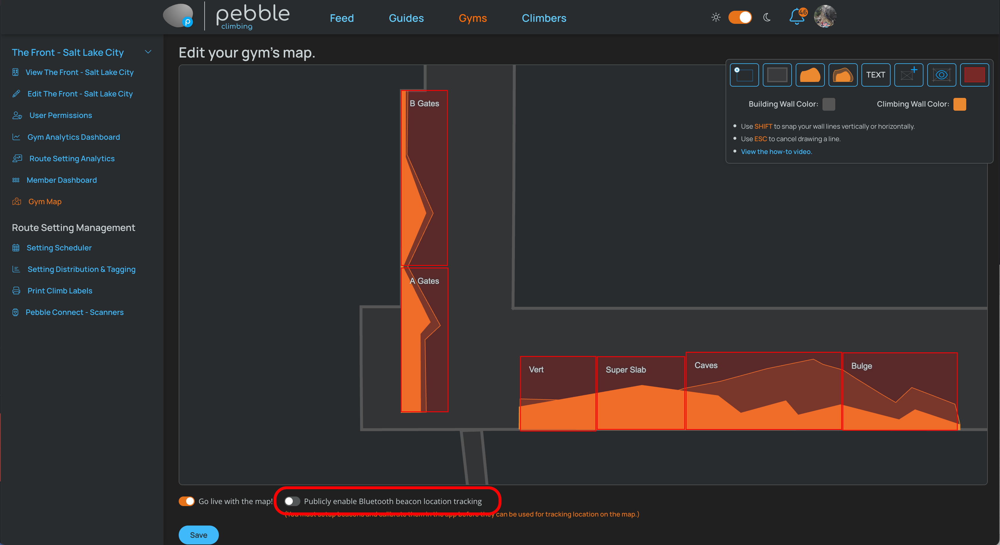

import PhoneImageWrapper from "../../src/components/PhoneImageWrapper"
import FingerPrintMap from "../images/fingerprint-map.jpg"
import EditBeaconsMap from "../images/edit-beacons-map.jpg"
import BeaconLocationMap from "../images/beacon-location-map.jpg"
import ImageSizer from "../../src/components/ImageSizer"

## Bluetooth Location Beacons

<ImageSizer src={BeaconLocationMap} alt="Beacon Location Image" width={"100%"} style={{
  border: "1px solid #ccc",
}} />

You can add Bluetooth location beacons to your gym to help users find their way around. This is especially useful for larger gyms or gyms with multiple levels.

### Adding Bluetooth Location beacons
To get good coverage, you should place beacons roughly 30 - 50 feet apart. So plan out where you want to place them so that you'll know how many you need, and then order them from Proxy Climbing [here](https://proxyclimbing.com).

Once you have your beacons, place them throughout your gym. You can place them on the walls, ceilings, or anywhere else that makes sense. Just make sure they are within range of the areas you want to cover.

**Make note of where your beacons are located. The beacons will last on a single set of batteries for up to 10 years. But, you will eventually need to replace the batteries. So, if you have a lot of beacons, it may be helpful to number them and keep a list of where they are located.**

### Calibrating The Beacons
Once you have your beacons placed, you will need to calibrate them. This is done by walking around the gym with your phone and letting the app know where you are. You will save "fingerprints" that correspond to beacon signals. These fingerprints will be used to determine the location for users of the app when they are in your gym.

To calibrate the beacons, follow these steps:
1. Open the Pebble app on your phone.
2. Make sure you are in ["Route Setting" mode](https://docs.pebbleclimbing.com/routesetting/setting-mode).
3. Navigate to your gym’s map.
4. Tap the "Setup Beacons" button.
5. Start at a corner of your gym and tap the "Save Position" button. Wait for the app to save the position. A blue dot will appear on the map where you saved the position.
6. Walk 10 paces in a straight line and tap the "Save Position" button again. Wait for the app to save the position.
7. Repeat this process until you have saved positions all around your gym and the little blue dots cover the entire area of your gym in a density that makes sense for your gym.

<PhoneImageWrapper alt="Edit Beacons Map" src={EditBeaconsMap} />
<PhoneImageWrapper alt="Fingerprint Map" src={FingerPrintMap} />

### Testing the Beacons
Switch to the "User" mode in the app and walk around your gym. You should see the blue dot on the map move as you walk around. If the blue dot is not moving, or if it is not accurate, you may need to recalibrate the beacons.

### Turning On Location for All Members
Once you have the beacons calibrated, you can turn on location for all members. This will allow them to see their location on the map.

Navigate to your gym's page on the Pebble website and click on "Gym Map". Find the switch labeled "Publicly enable Bluetooth beacon location tracking.", turn it on, and hit the save button. This will allow all members to see their location on the map.

