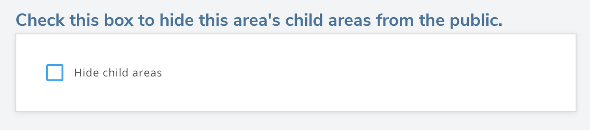
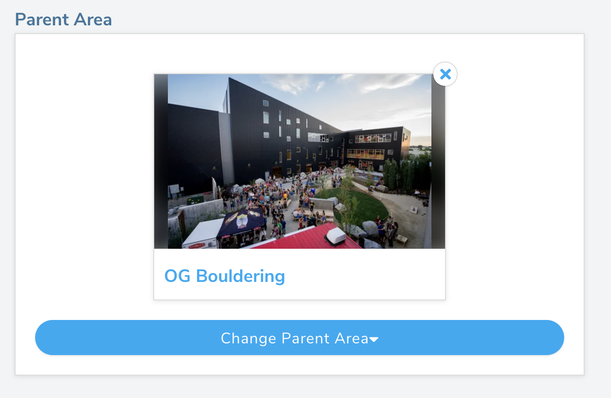
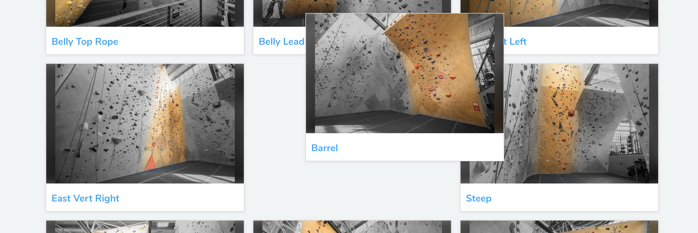

import ImageSizer from "../../src/components/ImageSizer"
import AddAreaImage from "../images/add-area.png"
import VideoPlaylist from "../../src/components/VideoPlaylist"

## Creating & Editing Gym Areas

<VideoPlaylist videoId="s1UsewBb4pA" />

Once you've created your gym, it's time to add areas to your gym. Make sure you are logged in and have "manager" permission.

<strong>
  When creating areas, it's best to keep them limited to sections of 20 or fewer
  climbs. This will help users when scrolling through the area's list of climbs
  and help the Augmented Reality find the climbs in the area more quickly.
</strong>

1. Go to your gym's page on pebbleclimbing.com, scroll down to the "Areas" section and click on the "Add an Area of the Gym" to create a new area. You can also create areas in the app by going to your gym's page, scrolling to the bottom, and clicking on the "Add an Area" card.

<ImageSizer
  src={AddAreaImage}
  alt="SetterFeedback"
  style={{ width: "100%", objectFit: "contain", height: 200 }}
/>

2. You will now see the area form. You can edit any area by clicking on the pencil icon next to the area name on the area page and it will bring you back to this form. Most of the fields are self-explanatory, but a few of them are explained below.

#### Check this box to hide this area's child areas from the public.

Checking this box will hide any areas from users that are child areas of this area. You can find more about parent and child areas below.

#### Weeks before a problem/route is old

This setting grays out climb rows if their publish date is older than the number of weeks you've set. This setting is also available on the edit gym page. But, you can use this setting in the gym area to override the gym's setting.

#### Grade Distributions

Once you've defined whether your area has problems, routes or both, you can define a default grade distribution for the area by clicking on the plus and minus buttons beside each grade. You may also want to set the min and max grades that this area could have so that it's easier to define the distribution.

You can see more about grade distributions in the [Assigning Distributions](/routesetting/assigning-distributions) section.

#### Parent and Child Areas

Once you have created an area, you can organize them in parent and child areas. This is helpful for larger gyms where a lot of areas can confuse the user.

Once all areas are created, parents and children, edit the child and under the section "Parent Area", select the area you want to use as a parent. Do this with every child area you wish to add to a parent area.

#### Organizing Your Areas

Once your areas are created, you can go back to your gym page and organize the areas in a way that makes the most sense. To do this, as long as you are either a manager or head setter, you can simply drag and drop the areas around on the page and this order will be kept when users of Pebble view your gym in the app or on the website.

