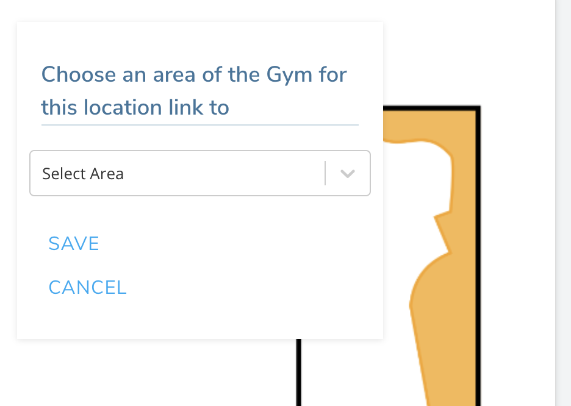

## Create Overview maps of Your Gym

In order to help Pebble users understand where your app defined areas are in your gym, you can create overview maps.

1. Go to your gym's page and scroll down to the "Areas" section. You'll see the "Create Overview Maps" link on the right side. Click on it.
   

2. In the form on the next page, name your map and drag an image representing the floor plan of this area. Hit "Save".

3. On the next page, click on the image where you want to add a label for an area in your gym, choose the area from the dropdown, and hit save. If you have not created any areas yet, please create your areas first.
   

4. Drag the created button to the area on the image that corresponds to this area in the gym. Click on the image again to add another area.

5. Once you have added all the areas you want to this overview image, scroll to the bottom of the page and click "Save". Don

6. To create more overview images, click on the "+ Add an overview map" on the left side of this page and follow steps 1-5.
