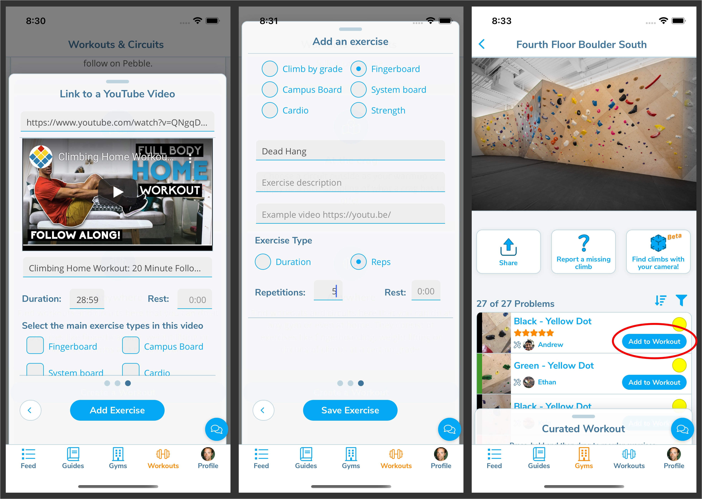

import PhoneImageWrapper from "../../src/components/PhoneImageWrapper"
import VideoPlaylist from "../../src/components/VideoPlaylist"

import Bitmap1 from "../images/workout-button.jpg"
import Bitmap2 from "../images/workout-duplicate.jpg"
import Bitmap3 from "../images/workout-save.jpg"
import Bitmap4 from "../images/workout-begin.jpg"

## Curated Workouts

<VideoPlaylist videoId="6lDTxOJHNTk" />

Each gym can have representatives on Pebble. In order to add users as representatives of your gym, add them in the [gym permissions](/gym-management/staff-permissions) and grant them "representative" permissions. If you need to be set up as a "representative", ask someone with "manager" permissions to add you.

In the future representatives will have more abilities, but for now their only one is to create curated workouts.

#### Creating a Workout

In order to create a workout and mark it as curated, navigate to the "Workouts" section in the app. Scroll all the way down and tap the **Create a Workout** button.

<PhoneImageWrapper alt="workout button" src={Bitmap1} />

In the card that slides up, name your workout and set it as both "public" and "featured". If you want you can wait to mark it as public or featured until you are finished creating the workout and have tested it.

You can add three types of exercises.

1. A **video** that users can follow along to
2. Various types of **exercises**, including climbs of a certain grade. You can also add videos to these exercises as an example of the exercise.
3. Specific **climbs** at a gym. In order to add specfic climbs, swipe down on the card and go find them in the gyms section.

Once you've added an exercise, you can duplicate that exercise by tapping on the duplicate button.

<PhoneImageWrapper alt="exercise duplicate" src={Bitmap2} />

Once you have finished creating your workout, hit save. Your workout is now created. Once you've tested it and are happy with it, mark it as curated and save it again. Your workout will now show up in the curated list for the section it belongs to.

<PhoneImageWrapper alt="exercise save" src={Bitmap3} />

Try out your workout when it shows up on the new page by clicking "Begin Workout".

<PhoneImageWrapper alt="workout-begin" src={Bitmap4} />
