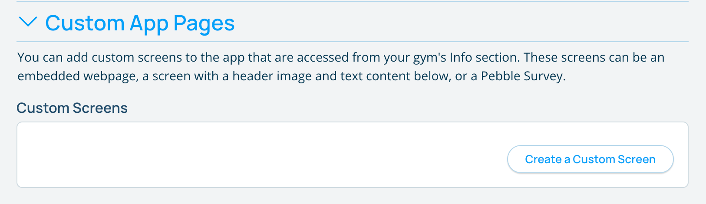
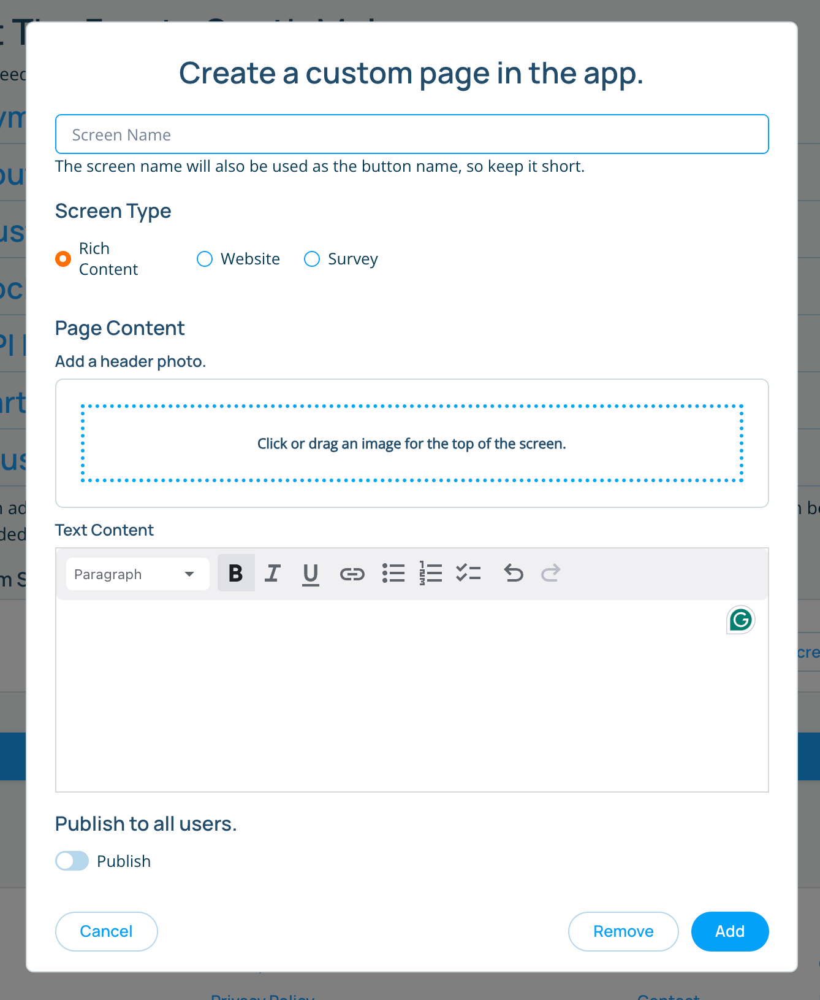

import PhoneImageWrapper from "../../src/components/PhoneImageWrapper"
import IphoneScreen from "../images/custom-gym-screen-iphone.png"

## Custom App Screens

You can create custom screens for your gym in the app. Screens can have child screens and can be nested to any depth. Screens can be of 3 different types:
* **Image & Text**: A screen with a header image and formatted text below. Only these types of screens can have child screens.
* **Webpage**: A screen that displays a webpage. This can be used to display a page on your website, a Rock Gym Pro membership or class signup, or any other webpage.
* **Survey**: A screen that displays a Pebble survey.

### Creating a Screen
1. Navigate to your gym's page and click the pencil icon next to the name to edit the page. 
2. Open the "Custom App Pages" section. 
3. Click the "Create a Custom Screen" button.

4. Fill out the form to create your screen.

#### Notes on creating screens:
* **Publish to all users** - If switched on, all users will see this screen. When off, only users with manager access will see this screen in the app. This allows you to preview the screen in the app before publishing it to all users.
* **Drag to reorder** - You can reorder the screens by dragging them up and down in the list. The order of the screens in the list is the order they will appear in the app. 
* **Child Screens** - Only Image & Text screens can have child screens. To add a screen as a child, choose the parent screen from the "Parent Screen" dropdown. Child screens will appear as card buttons below the parent screen text in the app. **In order for a screen to show up as a parent, the screens must be saved before creating the child screens.**

**The screens don't auto save when created. You must click the "Save Screens" button or "Save Changes" button at the bottom to save your changes.**

### Viewing the screens in the app
The screens show up in the app as a series of cards below the gym's information in the Info tab of the gym's page.

<PhoneImageWrapper alt="custom gym screens on phone" src={IphoneScreen} />

#### Notes on the app:
* **Eye Slash Icon** - If you see this icon on a button, this means that button and screen are hidden from the general public.

Once you are happy with the way your screens look in the app, you can go back to the gym edit page and click the "Hidden from the public" switch to publish the screens to all users. Make sure to save your changes after publishing the screens.