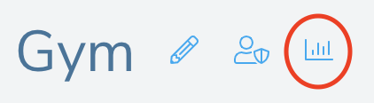
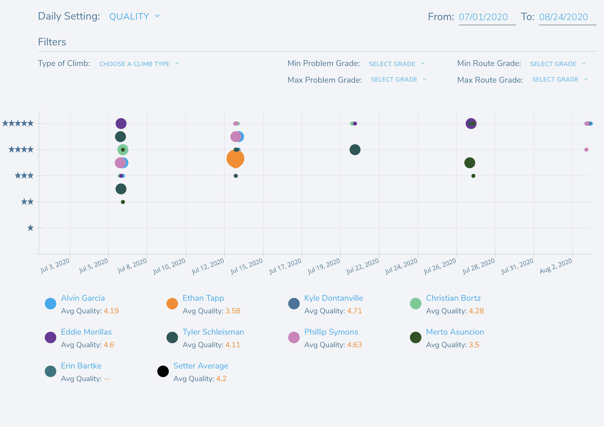

## Gym Analytics

Once your gym has been created and users have begun logging sends in the Pebble app, you can begin looking at your analytics.

Go to your gym's page and click on the graph icon to go to the analytics page.

This page allows you to explore your route setters' analytics based on the following metrics:

- quality
- grade accuracy
- popularity
- time checked out (time climb spent between checked out and published)
- hours / climb (assuming you've set up Rock Gym Pro integration)

To explore this data, you can change the start and end dates of the data, the metric being viewed and, by clicking on different setters names below the graph, you can toggle their data on and off.

You can hover over each point in the graph to see details about the data. If you see an error in any of the data, perhaps a setter forgot to clock out, you can hover over the point and click on the pencil icon to edit the data associated with that point.

For quality, grade accuracy, and popularity, the size of the dot on the graph represents the number of users that have added to the climb's value.

