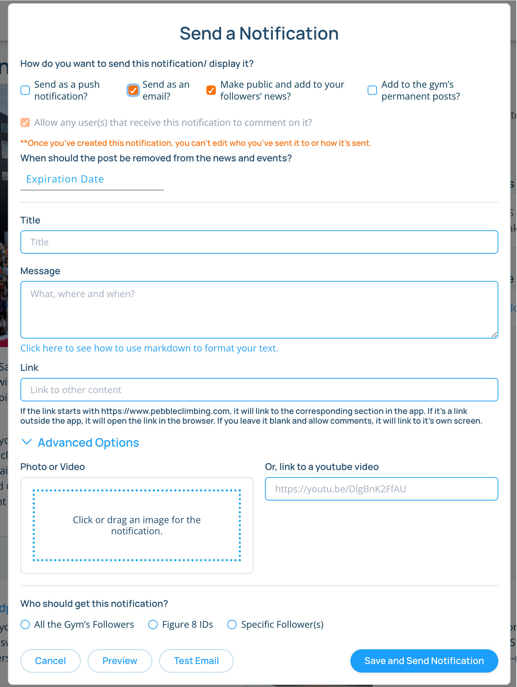
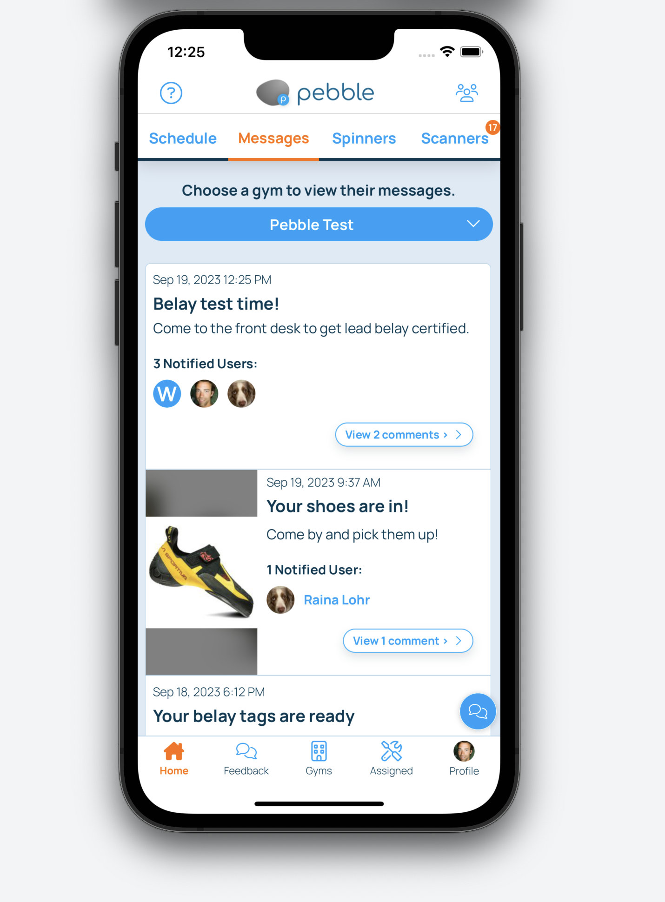

import VideoPlaylist from "../../src/components/VideoPlaylist"

## Notifying Users of News & Events

<VideoPlaylist videoId="aKne1Zy8N0I" />

You can use Pebble to directly message your users and notify your users of any upcoming news and events. Only users that follow the gym on Pebble will get a notification. Public notifications will show up in a users feed and News section. Direct messages will show up in their feed and their app notifications.

1. Navigate to the gym's page on [pebbleclimbing.com](https://www.pebbleclimbing.com/gyms)

2. Click on the "Create Notification" button.
   

3. Complete the form that shows up and hit save. Below are descriptions of each input to the form.
   

   #### How do you want to send the notification?
   * **Send as a push notification:** This will send a push notification to your audience. 
   * **Send as an email:** This will send the notification as a personlized email to your audience.
   * **Make it public and add to your followers news:** This will add the notification to your followers news feed. It will also show up in the News & Events section of the app and website.
   * **Add to the gym's permanent posts:** This will add the notification to the gym's permanent posts. It will show up in the News & Events section of the app and website until the expiration date, as well as the "Posts" section of the gym.

   #### Expiration Date
   Choose an expiration date. This is the date when the notification will stop showing up in the News & Events in the Pebble app and on the Pebble website. If added to the permanent posts, the notification will continue showing up there.

   #### Title
   The title of the Notification

   #### Subtitle
   Add some text here to add a subtitle to the push notification that goes out.

   #### Message
   What the notification is about. Where and when it's happening. You can style it with markedown code ([see here](https://www.markdownguide.org/cheat-sheet/)). If sending as an email, this will be your email content.

   #### Image or Video

   Add an image with your notification by dragging it to the box or add a link to a YouTube video.

   #### Link
   Optionally, add a link to your notification. This can link to an external site or a screen on pebble if it starts with https://www.pebbleclimbing.com and has a screen in the app. If you leave it blank, the notification will go to your gym page in the Pebble app.

   #### Test Push Button
   You can test your push notification before creating the notification, but if you don't include a link and are allowing comments, the push notification won't link to the notification because it isn't created yet.

   ## Managing User Messaging
   When you send out notifications to members as a direct message, you can manage the responses to those messages on both the website and in the app. On the website, go to the gym's page, and click on the "Member Messages" tab. You can see all the messages that have been sent out and the respond to them. In the app, if you switch to "manager" mode (see [here](/routesetting/setting-mode)), you can see the messages in the "Messages" tab.

   

   ## Subscribing an Email to Member Responses
   By default, the creator of any notification that is allowing comments will get a push notification when a user comments on that notification. You an also setup an email to receive any comments related to any notification that is sent out from your gym. This can help you quickly respond to any questions or concerns that members have. To do this, edit your gym on the website. Open up the "Gym Details" section and scroll down to "Member Messaging". Enter an email here for receiving an email any time a user comments. 

