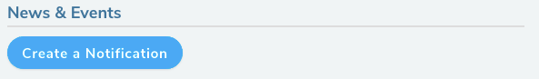
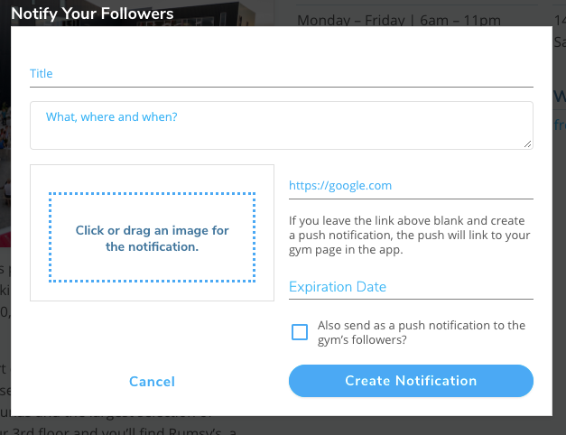

import VideoPlaylist from "../../src/components/VideoPlaylist"

## Notifying Users of News & Events

<VideoPlaylist videoId="aKne1Zy8N0I" />

You can use Pebble to notify your users of any upcoming news and events or any info about the gym. Only users that follow the gym on Pebble will get the notification. Notifications will show up in the user's feed as soon as you publish them and they will also show up on the Gym's screen in the app and page in the website until the expiration date.

1. Navigate to the gym's page on [pebbleclimbing.com](https://www.pebbleclimbing.com/gyms)

2. Click on the "Create Notification" button.
   

3. Complete the form that shows up and hit save. Below are descriptions of each input to the form.
   

   #### Title

   The title of the Notification

   #### Description

   What the notification is about. Where and when it's happening.

   #### Image

   Add an image with your notification by dragging it to the box.

   #### Link

   Add a link to your notification. This will link to an external site. If you leave it blank, the notification will go to your gym page in the Pebble app.

   #### Expiration Date

   Choose an expiration date. This is the date when the notification will stop showing up on the gym screen in the Pebble app and on the Pebble website.

   #### Send as push notification

   You can optionally send this notification as a push notification.
