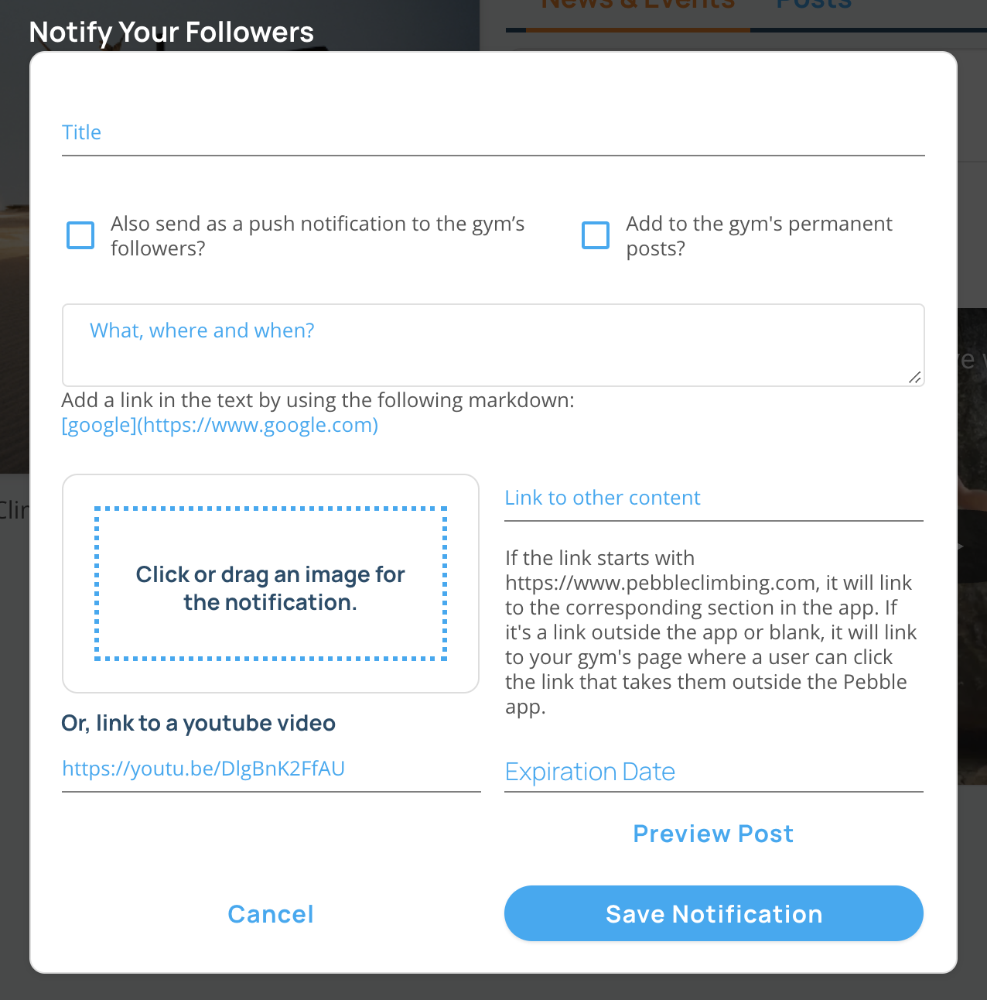

import VideoPlaylist from "../../src/components/VideoPlaylist"

## Notifying Users of News & Events

<VideoPlaylist videoId="aKne1Zy8N0I" />

You can use Pebble to notify your users of any upcoming news and events or any info about the gym. Only users that follow the gym on Pebble will get the notification. Notifications will show up in the user's feed as soon as you publish them and they will also show up on the Gym's screen in the app and page in the website until the expiration date. You can also use notifications as mini blog posts by marking them as permanent.

1. Navigate to the gym's page on [pebbleclimbing.com](https://www.pebbleclimbing.com/gyms)

2. Click on the "Create Notification" button.
   

3. Complete the form that shows up and hit save. Below are descriptions of each input to the form.
   

   #### Title

   The title of the Notification

   #### Send as push notification

   You can optionally send this notification as a push notification.

   #### Add to the gym's permanent posts

   If you check this box, the notification will show up under the gym's posts in the app and the website even after the expiration date.

   #### Subtitle

   Add some text here to add a subtitle to the push notification that goes out.

   #### Description

   What the notification is about. Where and when it's happening. You can add links by using markdown code: `[text to link](https://site.com)`.

   #### Image or Video

   Add an image with your notification by dragging it to the box or add a link to a YouTube video.

   #### Link

   Add a main link to your notification. This will link to an external site or a screen on pebble if it starts with https://www.pebbleclimbing.com and has a screen in the app. If you leave it blank, the notification will go to your gym page in the Pebble app.

   #### Expiration Date

   Choose an expiration date. This is the date when the notification will stop showing up in the News & Events in the Pebble app and on the Pebble website. If added to the permanent posts, the notification will continue showing up there.
