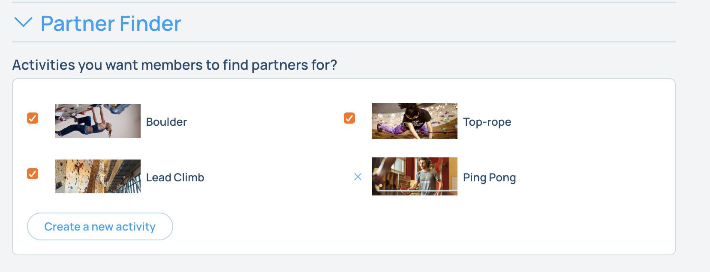

## Partner Finder

Pebble has a partner finder that allows users to meetup with others to climb or do other activities at your gym. 

To enable the partner finder, edit your gym on the website, and open the "Partner Finder" section. 

Select all the types of climbing at your gym. This will allow users to filter by the type of climbing they want to do. 

If your gym has other activities requiring a partner, for instance ping-pong, you can add those activities here as well.