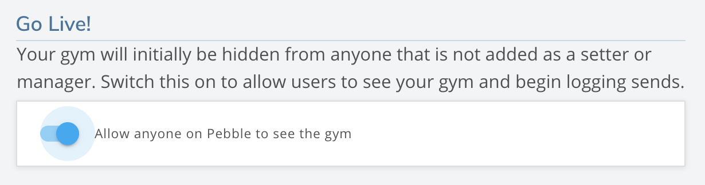

## Publishing Your Gym

Once you have created your gym, added areas to your gym, and added climbs to each area of your gym, it's time to publish your gym so that all users of Pebble can see your gym.

1. Edit your gym by clicking on the pencil icon beside your gym name on your gym page.

2. Click on the "Gym Details" section and then click on the switch below "Go Live!". Congratulations! Your gym is now live on Pebble!

