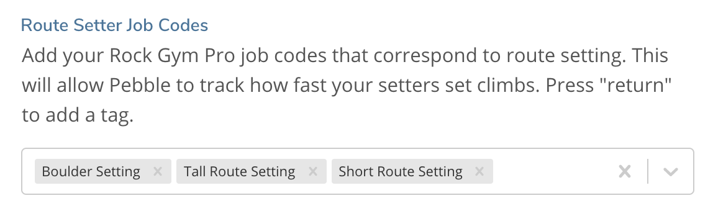
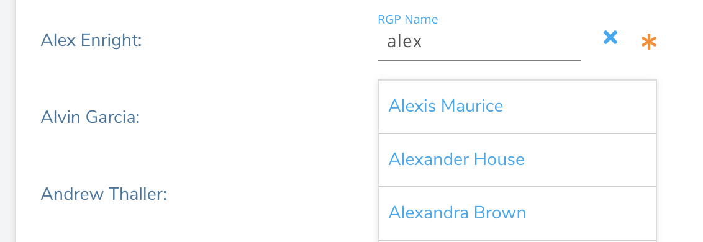

## Rock Gym Pro Integration

Pebble provides an integration with [Rock Gym Pro](https://rockgympro.com). If you use RGP as the timeclock for your route setters, Pebble can download your timeclock data and compare it to the number of climbs they have set in order to get your setter's setting efficiency.

### 1. Get your RGP API user and password from Rock Gym Pro

Navigate here: [https://support.rockgympro.com/hc/en-us/articles/360041610093-Rock-Gym-Pro-API](https://support.rockgympro.com/hc/en-us/articles/360041610093-Rock-Gym-Pro-API) and
follow the instructions under "Generating an API Key" depending on the type of RGP platform you have. Copy your 'username' and 'api key' that you've created.

### 2. Set up your RGP configuration on Pebble

1. Navigate back to your edit gym page on Pebble and paste in the API username and API Key into the corresponding textfields.

2. Click on the "Test Your Integration" button to get your facility codes.

3. Choose the facility code that corresponds to your gym.

4. Add the job codes that correspond to the job codes your route setters use when logging their hours.
   

5. Match your setters to their respective RGP accounts. Pebble will try it's best to match the names from your employees' accounts on RGP with their Pebble accounts, but many of these may be blank. If the corresponding feild is blank, you can begin typing in this box and the form will give you possible options from your RGP employee list.
   

6. Click "Link Setters to RGP Employees" to Save these links

7. Click the "Connect to RGP Timeclock Data" to initialize the connection between Pebble and RGP.
