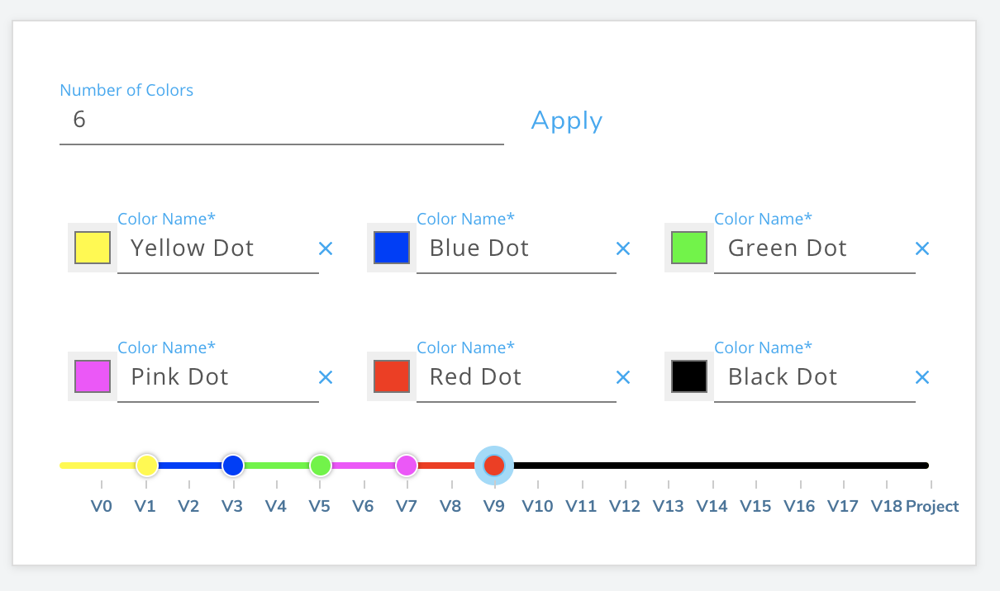

import ImageSizer from "../../src/components/ImageSizer"
import FeedbackImage from "../images/setter-feedback.png"
import VideoPlaylist from "../../src/components/VideoPlaylist"

## Route Setting Configuration

<VideoPlaylist videoId="DChfPgV15H8" />

You can set up your gym's route setting configuration using the second section of the form. Below will go through each setting.

### French or US Grading

Use this section to set your gym's preferred grading system. Even if your gym uses color grades and decides to hide the outdoor grades, it's important to define this since the corresponding outdoor grade is shown to the route setters when setting.

### Show Grades to Users

You can uncheck this box if you want to use color grades and hide the corresponding outdoor grades. Their are 3 possible options that Pebble users will see when going to your gym. You can show them the outdoor grade of the climb, the color grade and outdoor grade of the climb, or just the color grade for the climb.

### Hold/Tape Colors

Use this section to define the hold colors if you set a single route using a single color of hold, or your tape colors if you use tape to define your climbs.

### Route/Problem Grade Colors

Use this section to define the colors that you will use for grading. Enter in the number of colors you want to use and then choose and label each color. Then use the slider to define which colors correspond to which grades.

### Weeks Before a Route/Problem is old

This will be the default value for when you consider a climb turning old. When a climb is older than the weeks set here, the row for this climb in the Pebble app will turn slightly grayer, letting users know that it is about to vanish.

### Setting Feedback

You can turn on the switch to begin showing a setting feedback form for users when they log an attempt or send. When users fill out this form, the message will add an alert in the Pebble app for that route setter to see. You can additionally add emails you want this feedback sent to in the textfield.

<ImageSizer
  src={FeedbackImage}
  alt="SetterFeedback"
  style={{ width: "100%", objectFit: "contain", height: 280 }}
/>

<!-- Additionally, this feedback will be sent in the weekly setting reports. (See below) -->

<!-- ### Weekly Reporting -->

<!-- Add emails to this text field separated by commas in order to turn on weekly reporting. Analytics on each route setter will be sent to these email at the beginning of each week. The analytics will be for one week prior to the week that just ended. This is to ensure more data is collected from your members before sending the report. -->

### Rename All Climbs

Use this button if you decide to change your grading strategy. This will rename all your climbs based on the new strategy. For example, "Red V3" could be renamed to "Red Blue Dot".

<strong>
  Note: If you need to change your grading strategy, then save the gym and only
  then should you go back to the edit gym page and click this button.
</strong>
