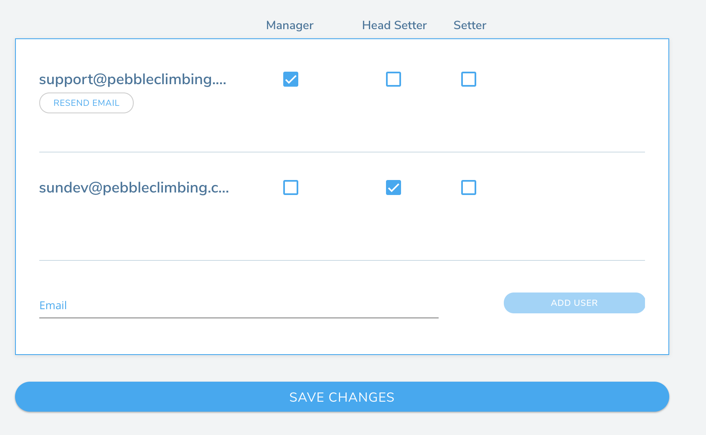

## Staff Permissions

Once you've created your gym, it's time to give other users access to your gym on Pebble. The Gym Permissions section can be reached by clicking on the icon below next to the gym name on the gym page.

### Adding Users

When adding users, make sure to only add the users you need, especially when it comes to Gym Managers and Head Route-setters. These users have the ability to change and adjust major features of your gym on Pebble.

On the gym permissions page, add an email and click on the checkmarks beside this email that correspond to the permission you wish to give that user.

<strong>
  You may want to ask anyone you plan on adding as a manager or setter whether
  they already have a Pebble account and if so, what email they are using. This
  ensures that they can use the same account as both a climber on Pebble and a
  manager or setter.
</strong>

<strong>
  Once you've addded all your users, make sure to scroll down and save them.
</strong>

All of your users will get an email either asking them to signup for Pebble or letting them know that they have been added as a manager or setter at your gym.
