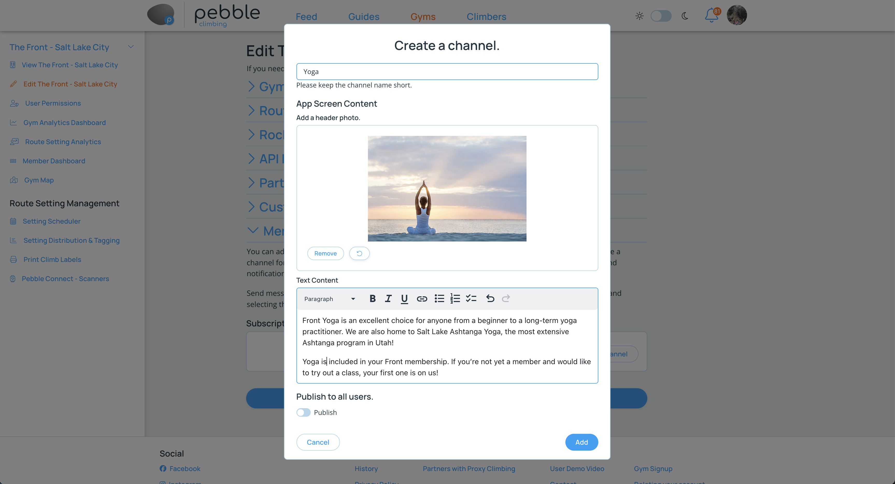
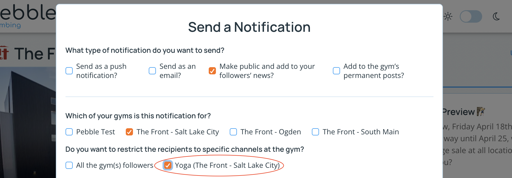

import PhoneImageWrapper from "../../src/components/PhoneImageWrapper"
import IphoneScreen from "../images/subscription-channels-iphone.png"
import IphoneScreen2 from "../images/subscription-channels-iphone-detail.png"

## Subscription Channels

Subscription Channels alllow your members to subscribe to a topic and receive notifications when new content is added to that topic. This is a great way to keep your members informed about new classes, events, and other important information.

## Creating a Subscription Channel
1. Navigate to your gym's page and click on the button in the sidebar to edit your gym.
2. Open the "Subscription Channels" section.
3. Click the "Create a Subscription Channel" button.
4. Fill out the form to create your channel.
5. You can leave it unpublished if you want to test out the channel among managers and setters before publishing it to all users.
5. Click the "Save Changes" button to save your changes.

## Viewing the Subscription Channels in the app

When a channel is created, it will automatically show up in the app under the gym's "Channels" tab. Users can subscribe to a channel by tapping the "Subscribe" button in the app on the channel's screen. Once subscribed, users will receive notifications when new content is added to the channel.

<PhoneImageWrapper alt="subscription channels" src={IphoneScreen} />
<PhoneImageWrapper alt="subscription channel detail" src={IphoneScreen2} />

## Sending a Notification to a Subscription Channel

1. Navigate to your gym's page on the website and [/gym-management/notify-users](create a notification).
2. Choose how you want to send the notification and if you choose to add it to your news, it will also show up in the channel screen in the app as a notification there as well. 
3. Select one or more channels to send your notification to.
4. Fill out the notification form and submit it. If channels are selected, only members subscribed to those channels will receive the notification. 

