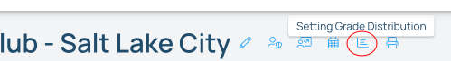
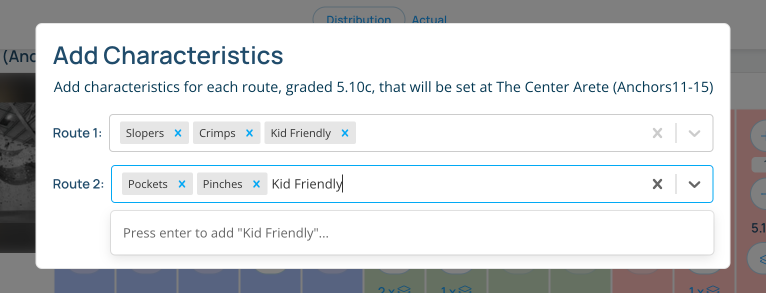
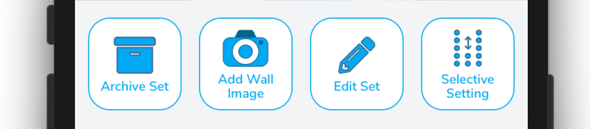
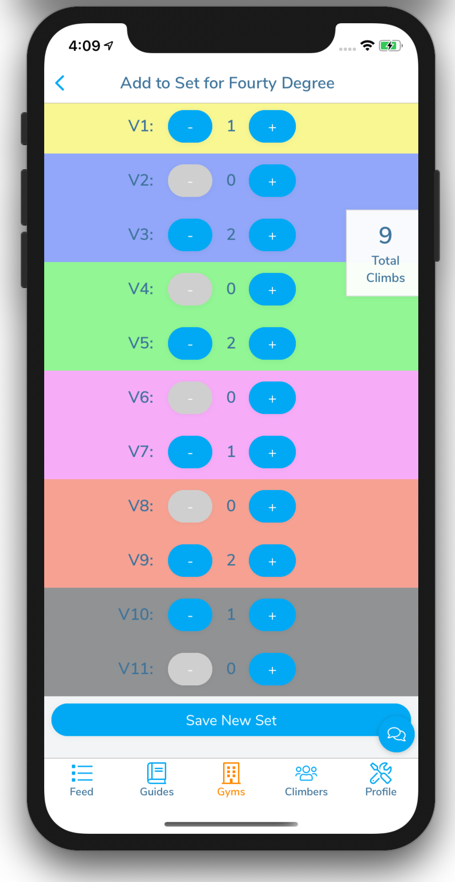

import VideoPlaylist from "../../src/components/VideoPlaylist"

## Assigning a Grade Distribution to an Area

<VideoPlaylist videoId="ISSFIWjcvAs" />

Each area in the gym can have a grade distribution assigned to
them. You can assign a distribution using either the website or the app.

### Assigning a Grade Distribution on the website

1. Navigate to your gym's page on [pebbleclimbing.com](https://www.pebbleclimbing.com)
2. Click the distribution icon at the top of the page.
   
   - Here you can adjust your grade distributions for each area as well as see the overall gym's distribution.
3. For each area, adjust the distribution by clicking the plus or minus buttons corresponding to each grade. You can also set a max and min grade for each area.
4. Once the distribution is set, you also have the option of adding characteristics to each climb. These can include characteristics that pebble tracks, like "crimpy", "slopey", or "compression", but can also be your own custom characteristics that the route setters will use to guide their setting.
   

### Assigning a Grade Distribution on the app

1. Navigate to the Gym Area in the App.
2. Make sure you are in "Route Setting Mode" in the app.
3. Navigate to the Gym Area using the "Gyms" tab in the App
4. Click on the "New Set" or "Edit Set" button
   
5. If you've already created a distribution, you can click the button "Use Last Distribution" and this form will be populated with the last climbs that were set on this area.
6. If this is the first set of climbs for this area, use the form to define the max grade for this area and the number of climbs at what grade you want for this area.
   
7. Save your changes and the gym area will be populated with a list of draft climbs for your setters to check out.
