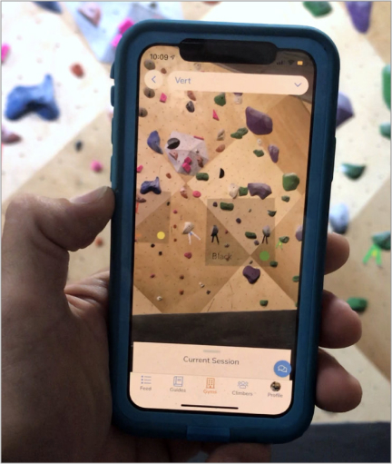

import ExternalLink from "../../src/components/ExternalLink"

## Augmented Reality

Pebble allows users viewing your gym to explore the areas using augmented reality. They can point their phone camera at the walls and an overlay will appear on the start holds of each climb.

Pebble's augmented reality works by constantly looking for the images the route-setters took when publishing climbs to the app. This means that many factors will go into how easily Pebble can find these images. The lighting, amount of chalk on the holds, angle and size of the picture, and many other factors all contribute to how well it will work. Below you will find some guidelines for taking start hold images that will help Pebble more easily recognize climbs.

### Angle of the Image

Regardless of the wall angle, you will want to take pictures with your phone held in portrait mode and perpendicular (vertical) to the ground. Users will be holding their cameras in a similar manner, so this will be the best way for Pebble to match the picture with the screen of the user.

### Chalk on the holds

As users climb on the problems, the start holds will accumulate chalk and shoe rubber. This will change what the start holds look like relative to the image when it was first taken. To account for this, you may want to pre-chalk your start holds with more chalk than you're normally used to adding. This way, the start holds will maintain a more consistent look throughout the life of the climb.

### Size of the image

Pebble expects the image to be a certain size in the real world and looks for a part of the screen corresponding to this size. Try to take an image that is between 1 - 2 feet wide. This may require you to only take a picture of one of the start holds. Keeping the image size smaller will also prevent starting hold squares that Pebble adds to the screen to not overlap each other.

### Markers

To further help Pebble recognize start holds, you can add "markers" like the one below next to the start holds and take start hold pictures that contain a marker.

You can download markers to laminate and place next to the start holds <ExternalLink href="https://pebble-ar.s3-us-west-1.amazonaws.com/ARMarkersPebble.pdf">here</ExternalLink>. When printing the markers please make sure they are at least 3 inches wide and work best at 4 inches.

<ExternalLink href="https://pebble-ar.s3-us-west-1.amazonaws.com/ARMarkersPebble.pdf">
  Augmented Reality Image Markers
</ExternalLink>

### Lighting

If an area in the gym has radically different lighting throughout the day, Pebble may not be able to recognize an image during certain times of day. There is not much that can be done about this, but you will want to take pictures when the lighting is constant and the outlines of the holds are most visible.

### Testing

The "AR View" is available on the area screen in the app when the route setters are setting climbs. They can easily use this to test that Pebble can recognize the image and change the image if needed.
