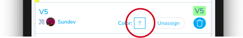
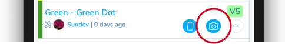
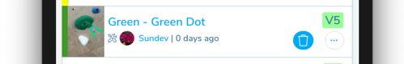

## Checking out & Publishing Climbs

After climbs have been assigned, setters can begin setting them.

### 1. Choose the hold/tape color

Either before or after the climb has been set on the wall, the setter can choose the color of the hold or tape used to mark the climb. Click on the box next to "Color?" on the climb's row.

Select the hold color or tape color for the climb from the menu of colors that comes up. In order to change the set of colors, follow the instructions outlined in [Gym Route Setting Info](/gym-management/create-gym/route-setting-info)

### 2. Your climb is published!

By choosing a hold color, your climb is automatically published to the Pebble App.

### 3. Add an Image

You can optionally add an image to help users find this climb on the wall. In order to integrate well with the augmented reality, it is best to take pictures of the start hold that represents roughly 1-2 feet across. This image will be displayed as a thumbnail on the climb's row, as a larger picture if the user taps the row and looks at the climb's detail page, and as the image that the augmented reality will search for when trying to find the climb. For more details about how to best take this picture so that it works well with the "AR Find" augmented reality, please refer to the [Augmented Reality](/routesetting/augmented-reality) section of the docs.

Click on the camera icon button on the row to take a picture.

On the screen that appears, take a picture of the starting holds or the entire route to add an image defining this climb.

