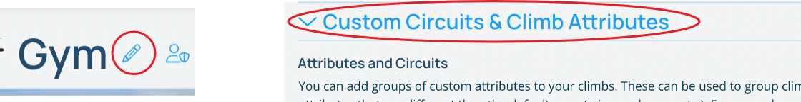
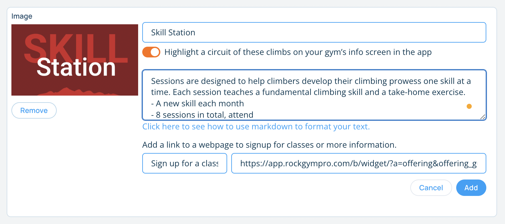
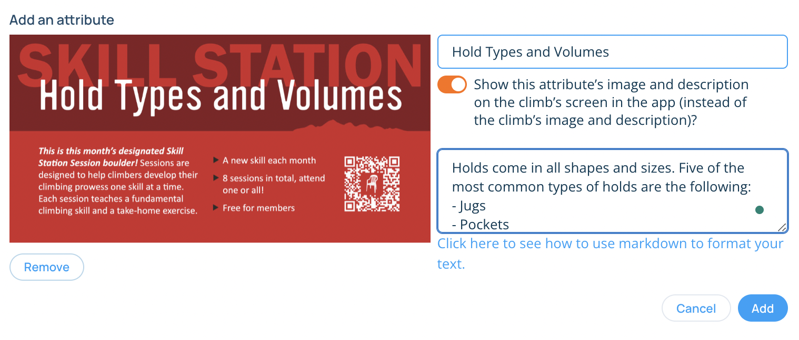
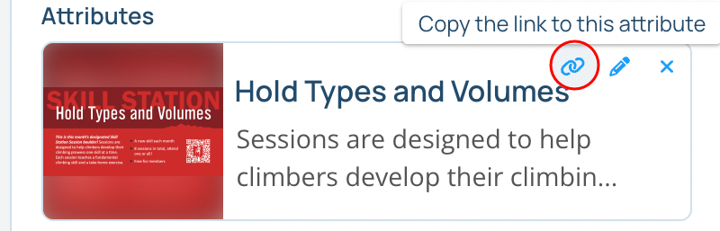
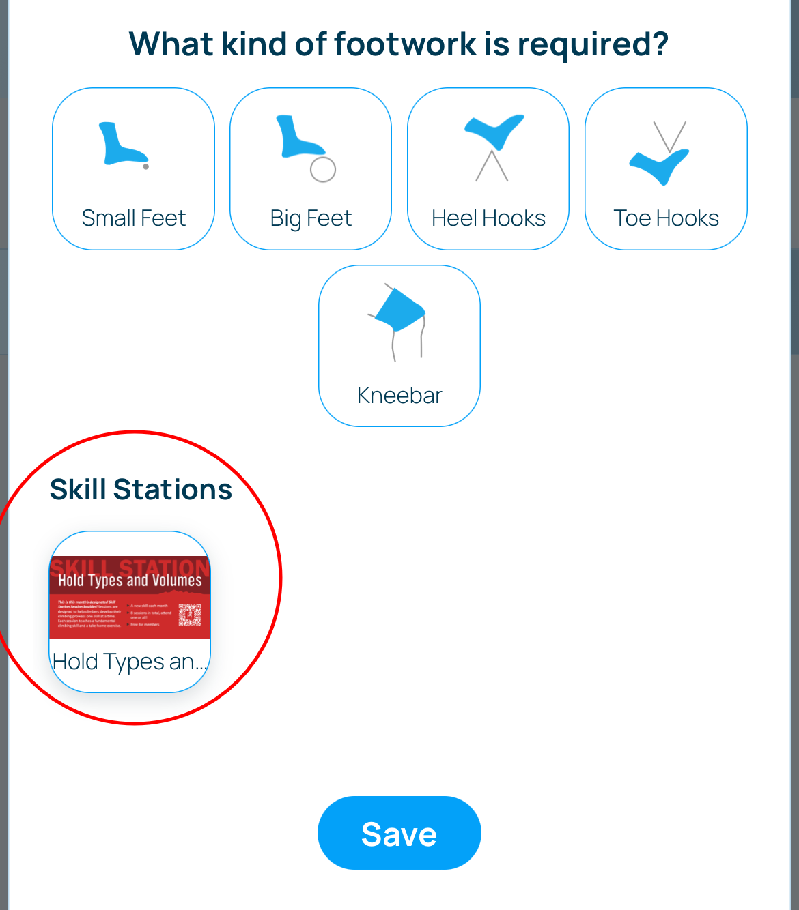
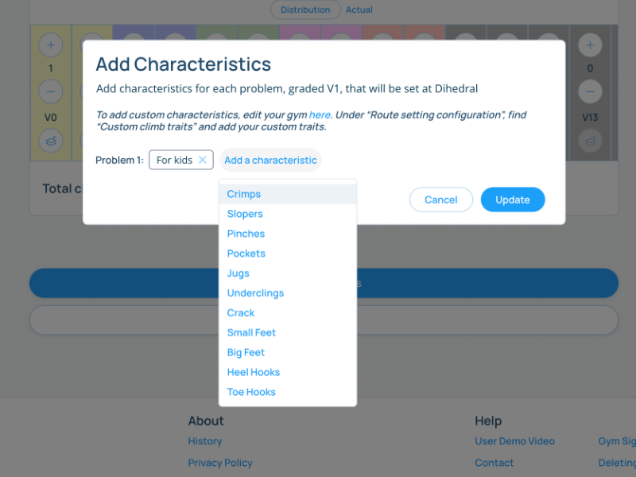

## Custom Circuits & Attributes

Pebble allows you to create custom attributes that you can assign to climbs as you're setting them. Additionally, these attributes are grouped together. This allows you to create circuits that can be highlighted in your gym's section of the app. Possible use-cases for custom circuits:

1. Custom attributes such as "Kids", "Topout", or "Campus" can be used to highlight climbs that are unique to your gym.
2. Groups of custom attributes can be used to create a "Skill Station" circuit, with different climbs in the gym representing different skills a new climber can learn.
3. A custom attribute could be used to create a "Setter’s Circuit" that highlights climbs in the gym that are a certain setter's favorite.

### Open the "Custom Circuits & Climb Attributes" tab on your gym's edit page.

Click on the pencil icon next to your gym name on the Pebble website. This will open the edit page for your gym. Click on the "Custom Circuits & Climb Attributes" tab to open the page for creating custom circuits and attributes.

### Create an attribute group

Click the "Add an attribute group" button to create a group to add attributes to. You can think of this group as a circuit of climbs with the attributes in this group. Fill in the form that appears. If you want to highlight this group as a circuit in the app, turn the switch on, add an image, description, and, optionally, add a link to classes or other information about the circuit.

### Add attributes to the group

Once you've created your group, it's time to add attributes to the group. Click on the "Add an attribute" button and fill out the form to create an attribute. The image for the attribute will either replace the climb's main image when viewing the climb screen or will be used as an icon listed with the default characteristics for the climb like "crimpy", "steep", "technical", etc.

If you want to add more attributes to the group, continue adding them. Once you are done, you can click the "Save & generate links" button. This will save the attributes to your gym and generate links for each group and attribute. These links can be used in signage as QR codes next to the climbs in your gym  to highlight these attributes or circuits.

### Add attributes to climbs when setting

These custom attributes will show up just like the default attributes (crimpy, slopey, etc.) in the Characteristics swiper that slides up in the app after you've published a climb in the app. To add any attributes to a climb, simply select them like you would any other attribute and tap save.

You can also edit attributes by navigating to a climb's page, tapping the pencil icon in the top right to edit the climb, and then scroll down to select a custom attribute and hit save. If you don't see the custom attributes on this screen in the app, make sure you're [in setter mode and have setter permissions](/routesetting/setting-mode).

### Using attributes to structure your setting

You can assign attributes to specific climbs in the distribution for a specific area in the gym. You can use this to make sure setters set specific climbs a certain way. For instance, you can assign a "For kids" attribute to specific climbs in the area's distribution so that each time an area is reset, climbs in the area will be set with kids in mind. You can also assign default attributes to the distribution so that, for instance, you make sure there's always a crimpy V3 set each time this area is reset.

Navigate to the area's page on the website, and click the pencil icon next to the area name. Then open up the "Route Setting Configuration" and scroll down to the grade distribution. Click on the layer button below the grade you want to add an attribute to.

Attributes and attribute groups are a powerful way to highlight specific climbs and connect your climbing to your members. These are just a few examples of ways to use them.

