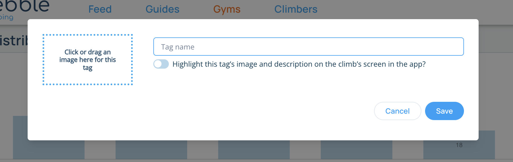
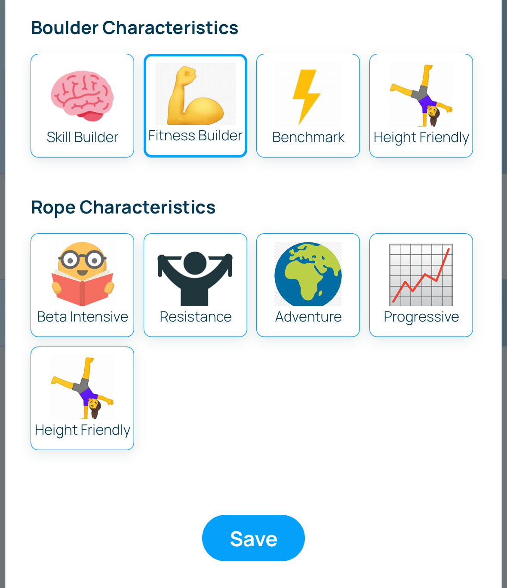
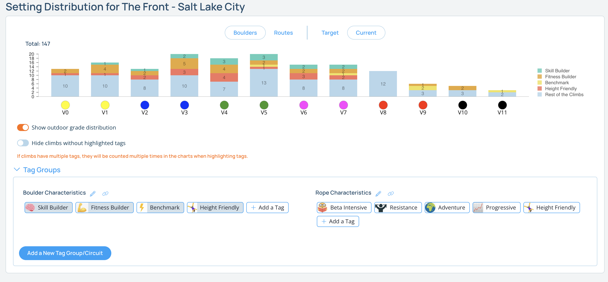

## Custom Circuits & Tags

Pebble allows you to create custom tags that you can assign to climbs as you're setting them. Additionally, these tags are grouped together. This allows you to create circuits that can be highlighted in your gym's section of the app. Possible use-cases for custom circuits:

1. Custom tags such as "Kids", "Topout", or "Campus" can be used to highlight climbs that are unique to your gym.
2. Groups of custom tags can be used to create a "Skill Station" circuit, with different climbs in the gym representing different skills a new climber can learn.
3. Custom tags can be used to make sure setters set certain climbs in a certain way. For instance, you can make sure there's always a height friendly v3 in your bouldering area.

### Go to the Gym Distribution.

Navigate to your gym's page and click on the "Setting Distribution & Tagging" link in the sidebar.

### Create a tag group

In the main chart at the top, open up the "Tag Groups" section and click on the "Add a New Tag Group/Circuit" button. Fill out the form to create a new tag group.

### Add tags to the group

Once you've created your group, it's time to add tags to the group. Click on the "Add a Tag" button and fill out the form to create a tag. 

### Add tags to climbs when setting

These custom tags will show up just like the default tags (crimpy, slopey, etc.) in the Characteristics swiper that slides up in the app after you've published a climb in the app. To add any tags to a climb, simply select them like you would any other tag and tap save.

You can also edit tags by navigating to a climb's page, tapping the pencil icon in the top right to edit the climb, and then scroll down to select a custom tag and hit save. If you don't see the custom tags on this screen in the app, make sure you're [in setter mode and have setter permissions](/routesetting/setting-mode).

### Using tags to structure your setting

You can assign tags to specific climbs in the distribution for a specific area in the gym. You can use this to make sure setters set specific climbs a certain way. For instance, you can assign a "For kids" tag to specific climbs in the area's distribution so that each time an area is reset, climbs in the area will be set with kids in mind. You can also assign default tags to the distribution so that, for instance, you make sure there's always a crimpy V3 set each time this area is reset.

Navigate to the area's page on the website, and click the pencil icon next to the area name. Then open up the "Route Setting Configuration" and scroll down to the grade distribution. Click on the layer button below the grade you want to add a tag to.

Tags and tag groups are a powerful way to highlight specific climbs and connect your climbing to your members. These are just a few examples of ways to use them.

### Highlighting circuits in the app

Any tag groups that you highlight as "Circuits" will also appear in the app in your gym's screen under the "Info" and "Area" tabs.

### Viewing the climbs in your gym by tag

You can also view the tag distribution of your gym's climbs by clicking on the tags below the chart. This will show the grade distribution of either your target or actual distribution. If you open up any of the areas below, you will also see that area's distribution by tag and the same settings as the main chart.

