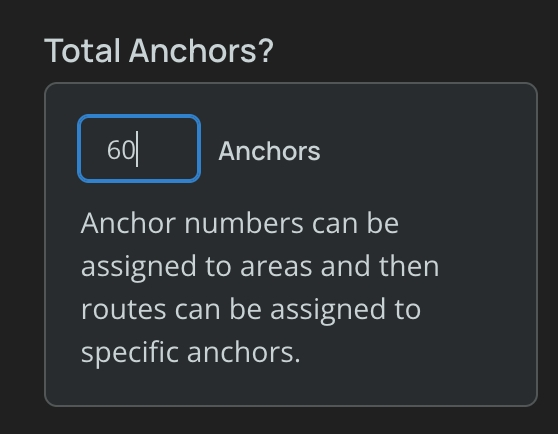
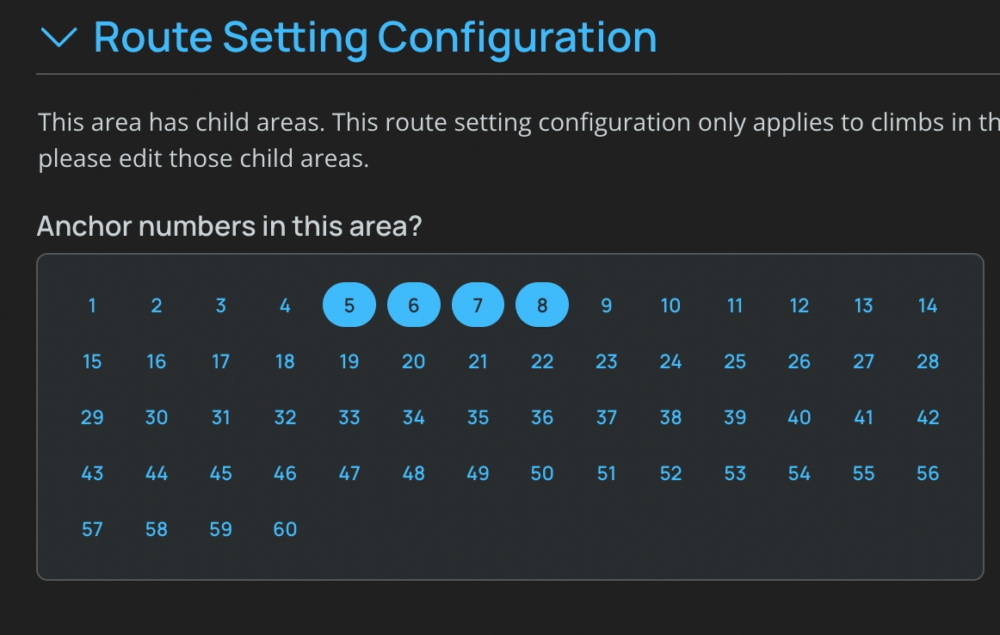
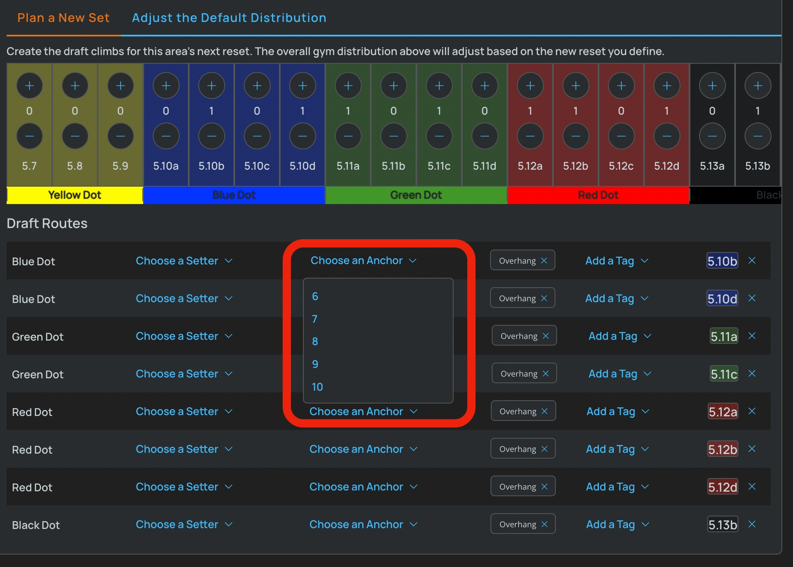

import PhoneImageWrapper from "../../src/components/PhoneImageWrapper"
import SetAnchorImage from "../images/set-anchor-in-app.jpg"

## Defining Anchors

If you choose, you can define anchors for areas and then specify which anchor a climb should end at. This is useful if certain climbs should stay within a certain area or if you want to have a specific anchor for a climb.

### Specifying how many anchors your gym has.

To specify how many anchors your gym has, follow these steps:
1. Navigate to your gym's page and click on the "Edit" button in the sidebar.
2. Open the "Route Setting" section.
3. Scroll down to the "Total Anchors" filed and specify how many anchors your gym has.
4. Click the "Save" button.

### Defining Anchors for an Area
To define anchors for an area, follow these steps:
1. Navigate to the area on the website and click on the pencil icon next to the area name.
2. Open up the "Route Setting Configuration" section.
3. Click on the numbers that correspond to the anchors in this area.
4. Click the "Save" button.

### Assigning an Anchor to a Climb on the website

To assign an anchor to a climb on the website, follow these steps:

1. Navigate to the edit gym area page by clicking on the pencil icon next to the area name.
2. Open the "Setting Distribution" section.
3. Create any draft climbs you want to assign anchors to.
4. Click on the "Choose Anchor" button in the row of the climb you want to assign an anchor to.
5. Select the anchor you want to assign to the climb.

### Assiging an anchor to a Climb in the App

To assign an anchor to a climb in the app, follow these steps:
1. Make sure you are in setter mode and navigate to the area screen.
2. Tap on the 3 dots icon to open the setter menu.
3. Tap on the "Set Anchor Number" option.
4. Select the anchor you want to assign to the climb.

<PhoneImageWrapper alt="Set Anchor in App" src={SetAnchorImage} />