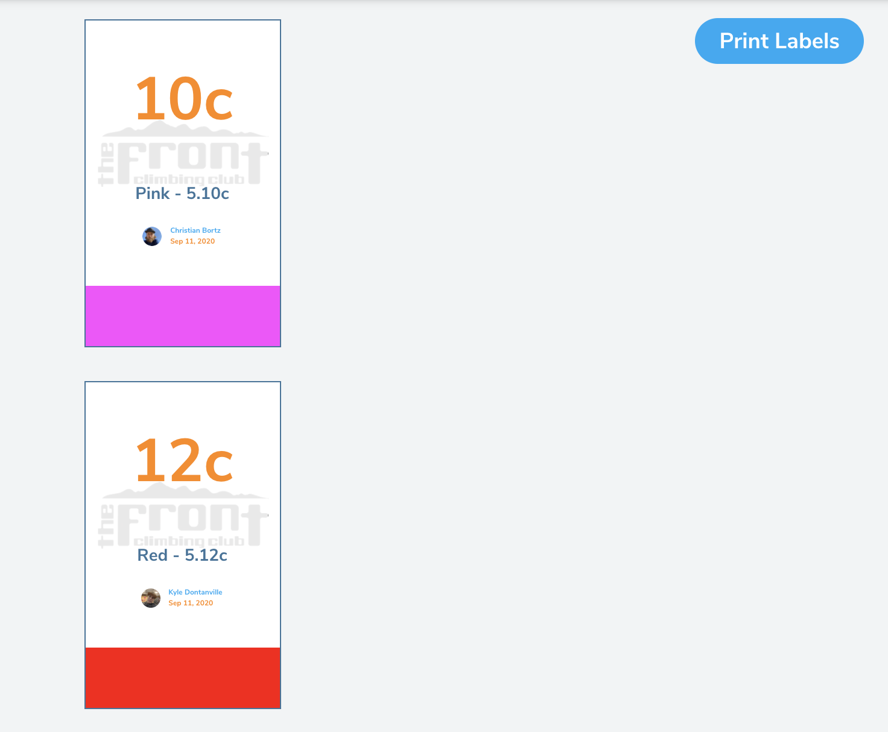

## Climb Starting Labels

Pebble allows you to create and print problem and route labels after you reset an area in the gym. Labels are sized at 3in x 5in.

### Click on the print icon at the top of the gym area page

Make sure you have setting or manager permissions and navigate to the gym area's page at [pebble.com](http://www.pebbleclimbing.com). Click on the print icon next to the name of the gym area at the top of the page.

 

### Preview & print the labels

Preview the labels and click print. If nothing opens after clicking on the "Print Labels" button, make sure a popup blocker isn't blocking the page from opening.

