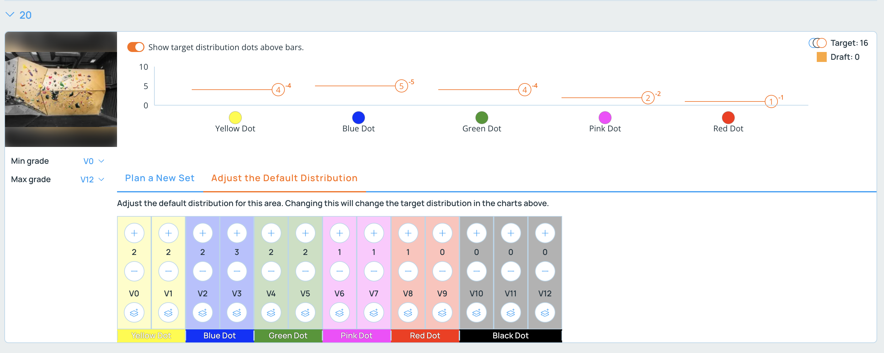
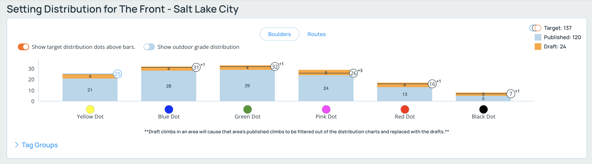
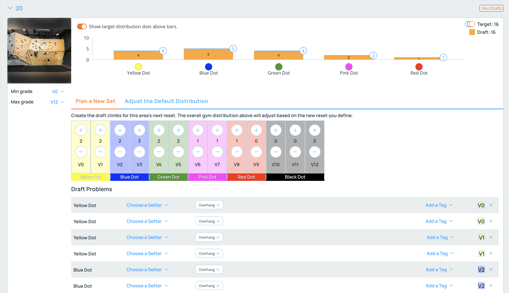
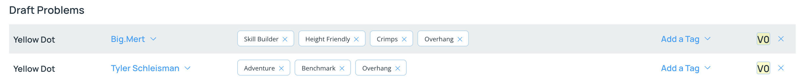

## Creating Distributions and Planning New Resets

### Grade Distributions
You can define a grade distribution for each area of your gym. All of the areas' distributions will define the overall gym distribution. You can then use this to make sure you maintain a consistent distribution across your gym.

From your gym's page on the website, click on the "Setting Distribution & Tagging" sidebar item.

For each area listed, open the area and click the tab labeled "Adjust the Default Distribution". Here you can set the grade distribution for the area.

As you adjust the distribution, you'll notice the overall gym distribution will update to reflect the changes.

### Planning a Reset

Once you have a distribution set for an area, or even if you don't, you can plan a reset for an area by clicking  the "Plan a New Set" tab on the "Setting Distribution & Tagging" page.

As you adjust the grade distribution for the area, you'll notice draft climbs will be created below and the overall gym distribution chart will update to reflect the changes.

If an area has draft climbs, then Pebble will use these climbs to calculate the overall gym distribution. If you don't have draft climbs, Pebble will use the currently published climbs to calculate the overall gym distribution.

You can go further and assign setters and characteristic tags to each draft climb in the new reset. You can also leave these fields blank and allow the setters to choose the climbs they set when they check out the climbs as they are setting.

