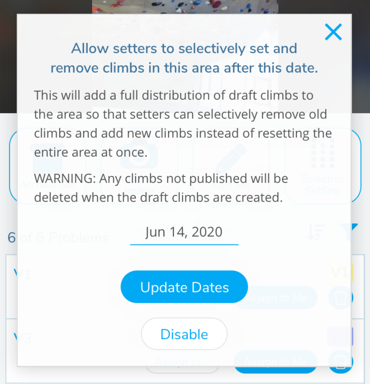

import VideoPlaylist from "../../src/components/VideoPlaylist"

## Selective Setting

<VideoPlaylist videoId="uDk18sMOSA8" />

Sometimes, especially when setting roped climbing, setters can't reset an entire wall in one day. Therefore, stripping the entire wall and resetting it isn't an option. The other option is to strip one or more of the climbs and replace those climbs with new climbs. But, in order for setters to maintain the grade distribution, they would have to reset the same grade that they stripped, confining specific grades to certain areas of the wall. Pebble solves this with the Selective Setting feature.

When Selective Setting is activated on an area in the gym, it creates a copy of all the climbs making up that area's grade distribution and sets them as draft. So when you turn it on, you have doubles of each climb, one published and one draft. Now the setters can pick and choose which climbs they want to strip and which climbs they want to set and they don't have to be the corresponding grade. When selective setting is turned on, all setters can archive individual climbs (instead of just head setters).

### 1. Turn on Selective Setting

Navigate to the gym's area screen where you want to turn on Selective Setting and tap the Selective Setting button.

### 2. Set the date for Selective Setting to begin

On the card that comes up, set the date you wish Selective Setting to begin. On this date, a new set of draft climbs based on the area's distribution will be added.

### 3. Delete and Publish

After this date, any old climbs can be deleted by any setters (instead of just head setters). This allows them to delete a climb once they've stripped it and to assign and publish climbs as they are set.
