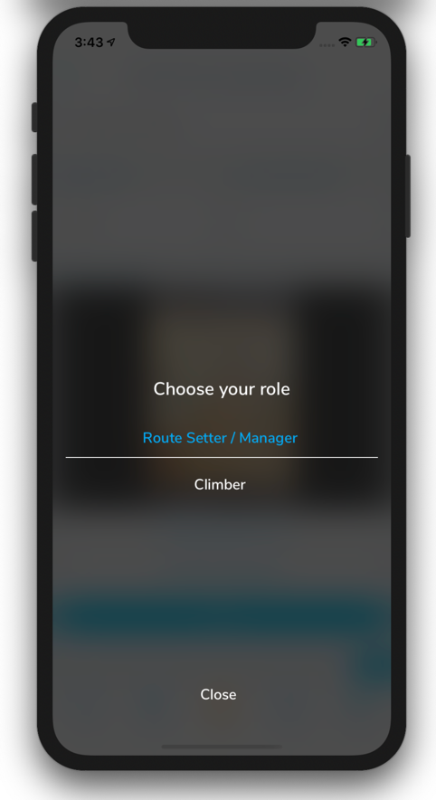

## Switching to "Route Setting" mode in the App

The Pebble app has a hidden mode that gives route setters access to a number of features that will allow them to manage the setting at their parent gym. In order to enable this mode or toggle quickly between "Setting Mode" and normal user, "Climber Mode", press and hold the "More" tab in the bottom right corner of the app. A menu will appear, allowing you to choose which mode you want to use.

