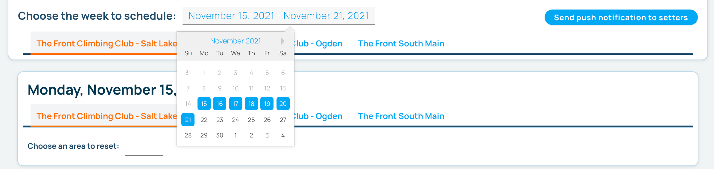
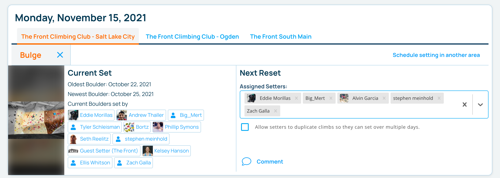

import ImageSizer from "../../src/components/ImageSizer"
import SchedulerImage from "../images/app-setting-schedule.png"

## Schedule your setters

The setting scheduler allows head setters to plan out the reset of gym areas weeks and even months ahead of time. You can assign setters to the areas they will be setting, discusss the reset within the schedule, and let them know when the schedule is complete. Setters can use the Pebble app to check their schedule and see when they are due to set.

### Click on the calendar icon on your gym's page on [pebble.com](https://www.pebble.com/gyms).

If you are a head setter at multiple gyms, navigating to the scheduler from any of those gyms' pages will allow you to see all the gyms.

### Choose the week you want to schedule setting for.

### Choose areas and assign setters

For each day of the week choose the area(s) you want to reset and assign setters to set them.

### Allow duplicating climbs

If this area will be reset over multiple days, you can select "Allow setters to duplicate climbs...". Doing this will enable any setter to duplicate the current setting distribution of climbs, so they can strip single climbs and replace them with other climbs in the distribution. This is useful if an area is too large to reset in a single day.

### Optionally add comments

Add comments to let the setters know of any particulars about this reset.

### View the schedule in the app.

All setters can view their schedule in the app. Head setters can also view the schedule for all the setters.

<ImageSizer src={SchedulerImage} alt="App Setting Schedule" width={300} />
