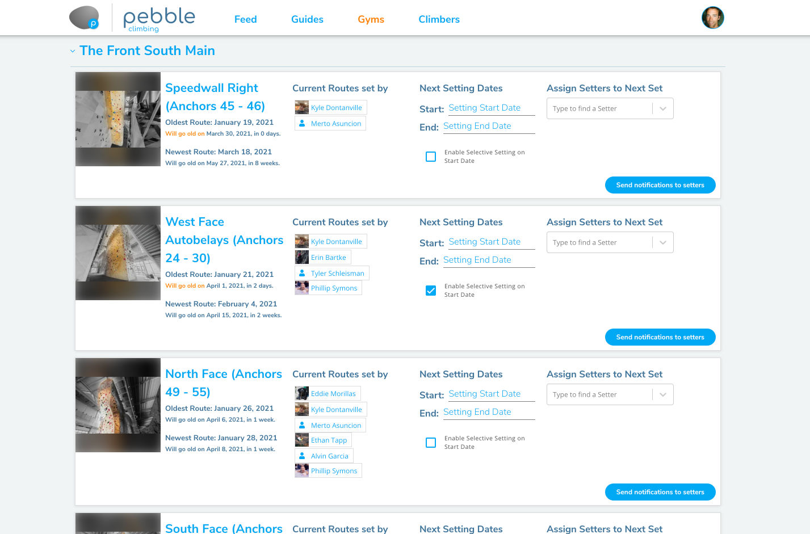

## Schedule your setters

The setting scheduler gives head setters an overview of all the areas in the gym or gyms they set at and allows them to assign when walls will be reset and notifies setters of the walls they're assigned to.

### 1. Click on the calendar icon on your gym's page on [pebble.com](https://www.pebble.com/gyms).

If you are a head setter at multiple gyms, navigating to the scheduler from any of those gyms' pages will allow you to see all the gyms.

### 2. Open a gym and for each wall/area:

1. Choose a date you want the setters to set this wall.
2. Select the setters you want to reset this area.
3. Optionally check selective setting to create a duplicate set of draft climbs on the day the setting starts (See [Selective Setting](/routesetting/selective-setting))
4. Once you are happy with the schedule for an area, click "Send Notifications to Setters" to send the setters an email, letting them know when they are scheduled to set.

