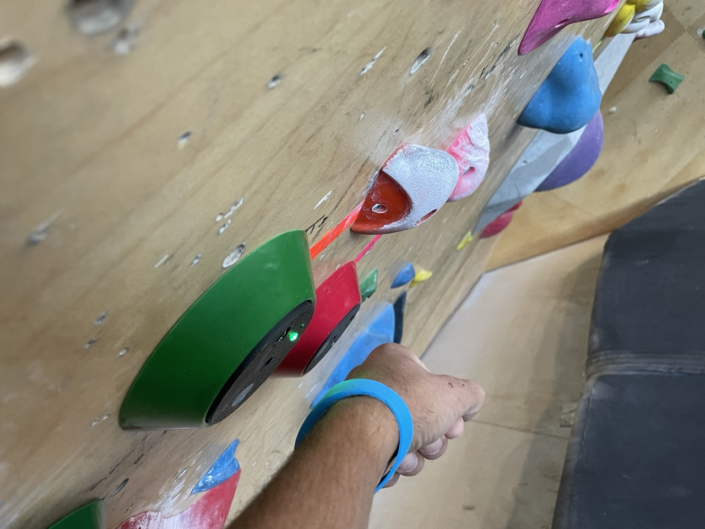

## Pebble Connect

Pebble Connect allows your members to completely bypass the app and log their climbing sessions with a simple tap of their wrist on scanners that you place at the bottom of each climb. 

Additionally, you can optionally use the scanners to log activities other than climbing and assign redeemable points to them. For example, you can use the scanners to log yoga classes, sends, and attempts, and then assign points to each of those activities. You can then allow your members to redeem those points for prizes, such as percent off coupons, free passes, or free gear.

### Logging your session with the scanners

When using the scanners to log your climbing, there will be a scanner associated with each climb at the start of the climb. Tapping this scanner with the wristband linked to your account will log an attempt on the climb. There will also be "send" scanners that are not associated with a specific climb. If you tap one of these with your wristband, it will convert your last attempt to a successful send of that attempt's climb.
