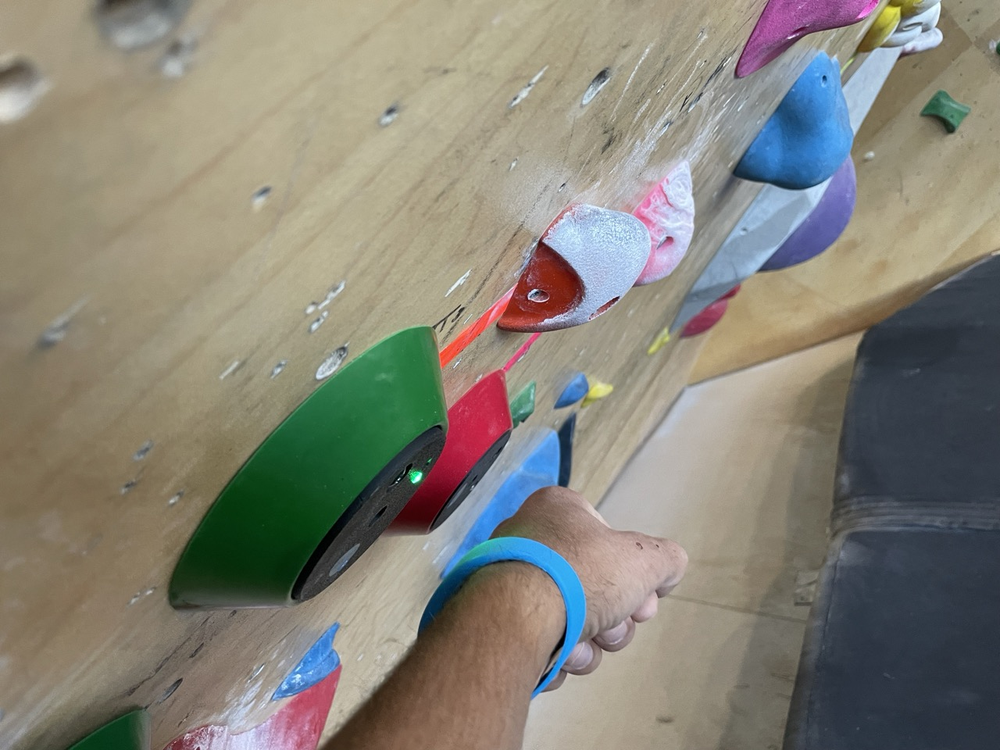
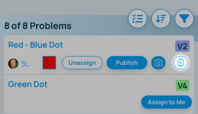

## Adding a scanner to a climb

Once your gateways are setup, you can start adding scanners to each climb. Depending on your grade setup and the colors and types of scanner rings your gym decided to use, grab the appropriate ring and a scanner and bolt it onto the wall next to the starting holds of the climb you want to assign it to.

The scanner has probably shut itself off to conserve power. Scanners will shutdown when the center hole is blocked for more than 30 seconds. To turn it back on, press the reset button and wait for the green light to shutoff. If you see a red light after the green light shuts off, that means their was an error. Try pressing the reset button again.

After the scanner has been turned on, open the Pebble app, make sure you're in setting mode. Navigate to the area and climb you are assigning the scanner to. You will see a little "watch" icon on the climb's row. Tap that, and then take the wristband associated with your account and scan it on the scanner you just installed. The app will confirm that the scanner has been assigned to the climb. 

Repeat for the rest of your climbs.

