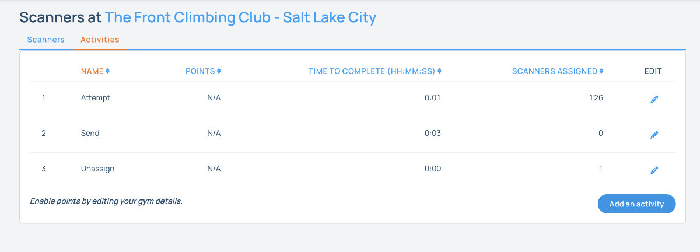
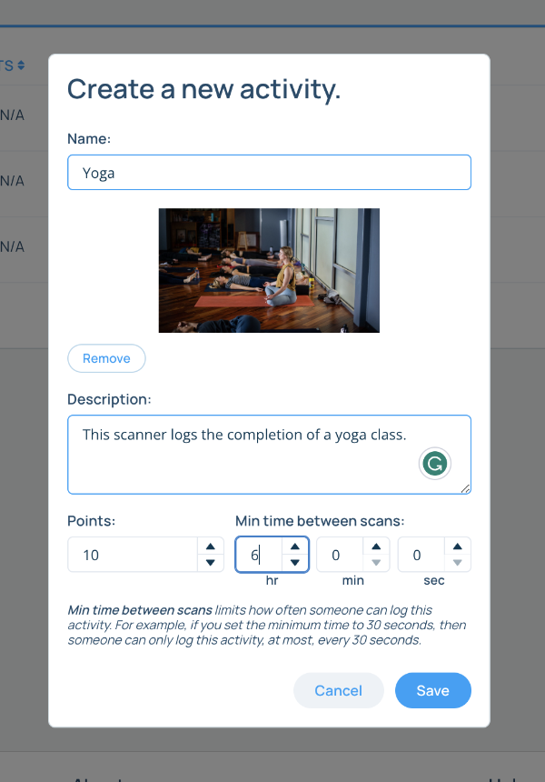

## Assigning Activities to the Scanners

Scanners can be used to log activities other than climbing. You will first need to add the activities you want to use through the website. 

Navigate to your gym's page at [www.pebbleclimbing.com](https://www.pebbleclimbing.com) and click on the "View Active Scanners" icon to the left of your gym's name.

Here you can view the status of all your scanners and add new activities. Click on the "Activities" tab to add or edit your activities. "Send", "Attempt", and "Unassign" should always be present. You can add new activities by clicking on the "Add an Activity" button.

### Adding an Activity

When adding an activity, you will need to provide a name, an optional description and image, and a minimum log rate and points if your gym is supporting points. 

#### Minimum log rate

The minimum log rate is the minimum amount of time that must pass between two logs of the same activity. This stops users from abusing the system if an activity is worth a certain amount of points. For example, if you have an activity called "Yoga" that is worth 10 points, you can set the minimum log rate to 12 hours so that users can't log more than one yoga class per day.

#### Points

We are still figuring points out. We'll update this section once we have a better idea of how we want to implement them.