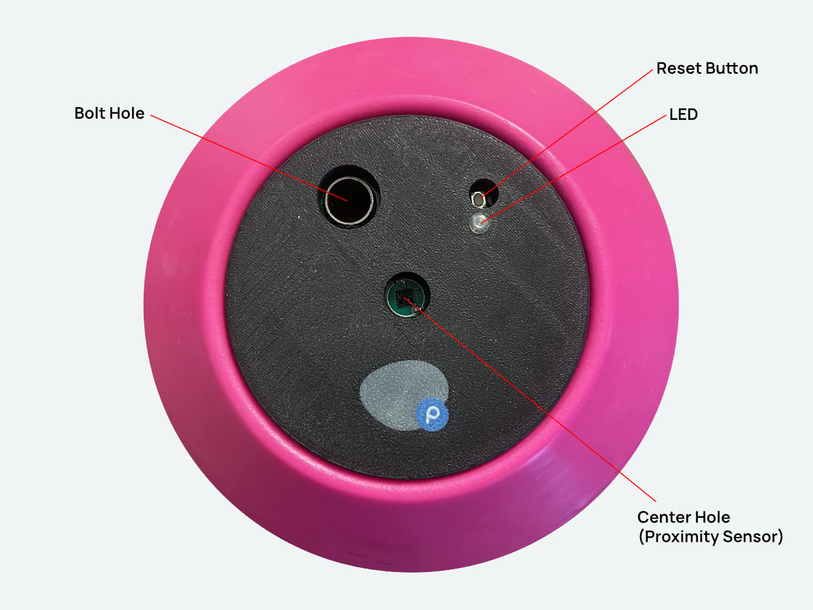

### Scanner Features

Scanners have 4 main features:

1. **Bolt Hole** - Use this hole to bolt the scanner to the wall. Make sure not to use a martini bolt or any bolt that may press against the sides of the sleeve inside the hole. This sleeve is meant to protect the circuit board, and if a bolt starts pushing against the sides of the sleeve, it may cause damage to the circuit board.

2. **Reset Button** - this is a small button that can be used to reset the scanner. This is useful to turn the scanner back on if it has shutdown after the center hole is covered for too long.

3. **LED** - this is a small LED that will light up when the scanner is tripped. This is useful for debugging purposes, but can be disabled if you don't want the LED to light up.

4. **Center hole** - this is where the scanner's proximity sensor is located. Scanners are by default in a low power mode, and will only wake up when something comes close to this hole. This allows the scanners to run for months on a single battery charge. When tripped, the scanner will wake up and start scanning for a wristband. If a wristband is detected, it will log the appropriate activity and go back to sleep. If no wristband is detected, it will go back to sleep after a few seconds.

### Scanner shutdown

To preserve battery life when removed from the wall, scanners will completely shutdown if the center hole is covered for more than 30 seconds. This means that if you put the scanner in a bag or box, it will not drain the battery. To turn the scanner back on, press the reset button. When placing the scanner around the gym, keep in mind that you want it to be in a vertical position so that chalk doesn't get in the center hole and cause it to shutdown. You also want to make sure the scanner isn't in a place where someone might lean against it and cause it to shutoff.